# 005 재발 검증 — 「상」 9건 재점검 (2026-09-07)

`docs/ux/ux-walkthrough-2026-09-07.md` 의 영향도 **「상」 9건**이 실제로 고쳐졌는지만 확인한
세션이다. 새 워크스루가 아니다. 절차는 `specs/005-ux-walkthrough-repair/quickstart.md`
§2 의 S1~S8 을 그대로 걸었다.

## 판정 요약

| # | 항목 | 판정 |
|---|---|---|
| U-01 | 결과 화면 재실행 두 버튼이 항상 409 로 거부됨 | **해소** |
| U-02 | 부분 실행이 건너뜀을 말하지 않고 「0 / 7」로 덮음 | **해소** (잔존 1건) |
| U-03 | 중지가 "세션 유실" 오류가 되고 FAIL 로 기록됨 | **부분 재발** |
| U-04 | 일시정지가 즉시 "정지했다"고 말함 | **부분 재발** |
| U-05 | 일시정지 「계속하기」가 실패 Step 을 건너뛰고 「완료」 표시 | **해소** |
| U-06 | 「처음부터 실행」 연타로 브라우저 창 다중 생성 | **해소** |
| U-07 | 목록의 실패 Step 번호가 1 작음 | **해소** |
| U-08 | 끝난 뒤 「중지」가 활성이고 무확인 폐기 | **해소** |
| U-24 | 미리보기가 대상 화면을 못 보여줌 | **해소** |

9건 중 **해소 7 · 부분 재발 2 · 확인 불가 0**.
부분 재발 2건은 모두 **핵심 증상은 사라졌고 곁가지 문구·잔여 UI 가 남은** 형태다.

자동 테스트(§1·§3): `backend` `uv run pytest` → **1371 passed** (927s).
`frontend` `npx vitest run` → **32 files / 300 tests passed**.

---

## 검증 환경

- 격리 XDG: `XDG_DATA_HOME`/`XDG_CONFIG_HOME` 을 스크래치패드로 지정. 사용자의
  `~/.local/share/itb` 무접촉.
- 전용 포트: 대상 앱 4400 · API 4420 · UI 4410. 사용자의 4310·4320 서버는 손대지 않았고
  검증 종료 후에도 살아 있음을 확인.
- 검증 재료(quickstart §0 의 표대로 새로 만듦, 제품 코드 무수정):
  - **TC-001 = TC-FAIL** 7 Step. 01~05 로그인 통과 → 06 은 없는 `testId=dashboard-open`
    을 20초 기다린 뒤 실패 → 07 미실행.
  - **TC-002 = TC-PASS** 5 Step. 항상 통과.
  - S5 에서 녹화로 만든 **TC-003** 5 Step.
- 조작 방법: S1~S4·S6~S8 은 **제품 프론트 직접 조작**. S5(직접 녹화)만
  **CDP 하니스**(`--remote-debugging-port` 만 주입, 제품 로직 무수정)로 실제 Chromium 을
  사람처럼 조작했다. 하니스가 판정에 영향을 준 항목은 없다 — S5 는 「상」 9건 대상이 아니다.

---

## 항목별 판정

### U-01. 결과 화면의 재실행 두 버튼 — **해소**

- **조작**: TC-001 실행 → 실패 → 러너의 「결과 자세히 보기」 → 결과 화면 → 「처음부터 실행」.
- **관찰**: 노란 경고 없이 `POST /api/sessions` **201**, 즉시 새 세션의 러너로 이동
  (`?screen=runner&session=d5d5…`). 직전 실행의 종료 세션 2건이 등록에 남아 있는 상태에서도
  거부되지 않았다.
- **거절이 필요한 경우의 문구도 바뀌었다**: 정말 실행 중일 때만 409 가 나고, 그때 화면은
  「TC-001 가 지금 실행 중입니다 / 실행 중인 세션으로 이동한 뒤 중지하세요」 와
  **「실행 중인 세션 보기」 버튼**을 그 자리에 준다 (리포트 개선안 3 그대로).
- **증거**: 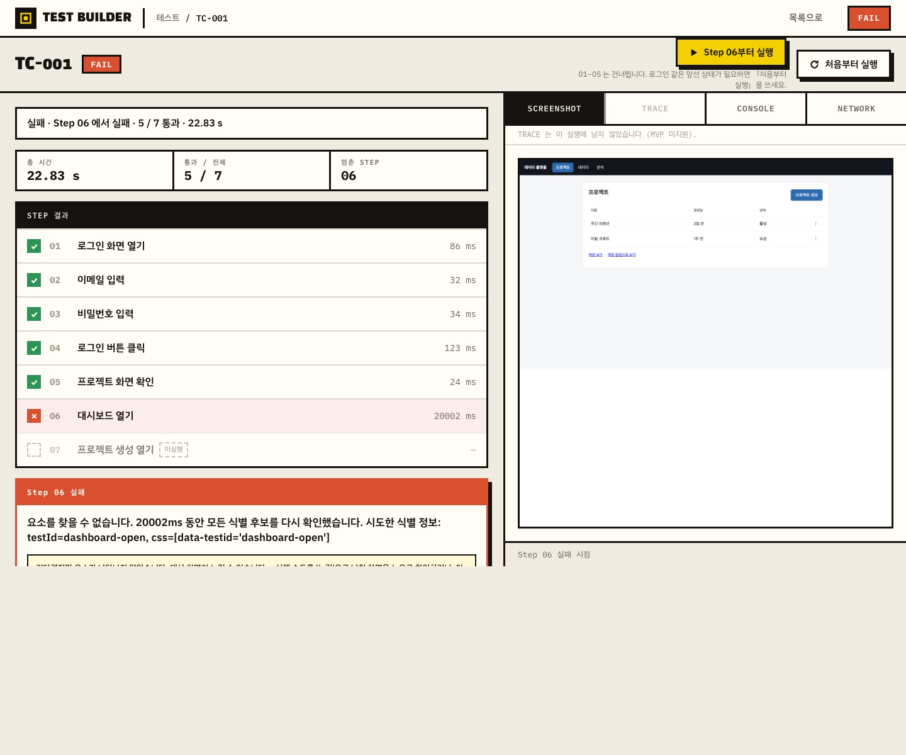 ·
  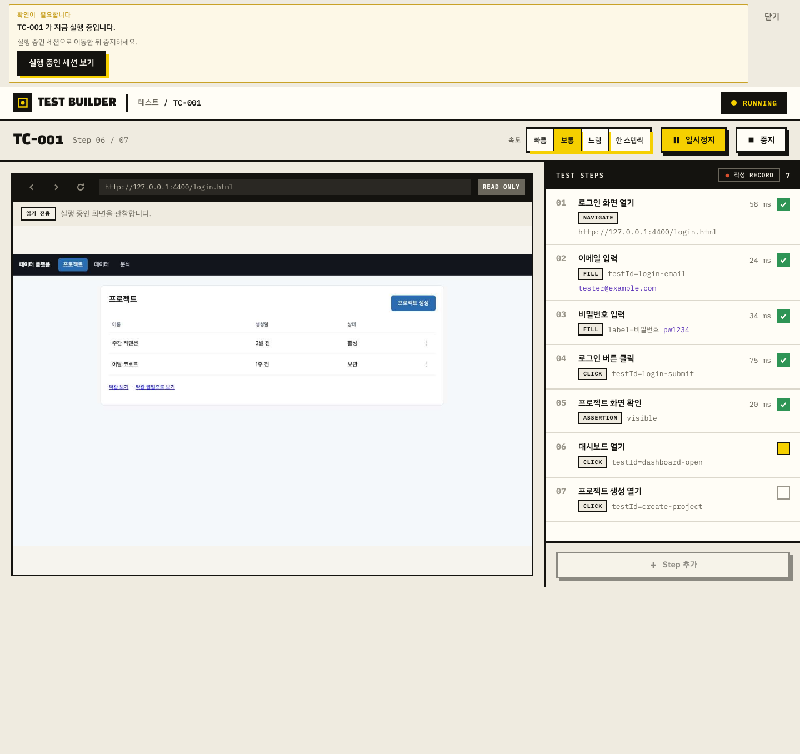

### U-02. 부분 실행 표기 — **해소** (진단 첫 줄만 잔존)

- **조작**: 결과 화면에서 「Step 06부터 실행」 → 완료까지 관찰 → 결과 화면 재확인.
- **해소된 것**
  - 버튼 라벨에 시작점이 박혔다 — 「**Step 06부터 실행**」. 옆에 보조 문구
    「01~05 는 건너뜁니다. 로그인 같은 앞선 상태가 필요하면 「처음부터 실행」을 쓰세요.」
  - 실행 중 Step 목록에서 01~05 가 「**건너뜀**」 칩으로 표시된다.
  - 요약이 「실패 · **부분 실행 Step 06~07** · Step 06 에서 실패 · **0 / 2 통과** ·
    **(01~05 건너뜀)** · 20.03 s」. `0 / 7` 이 아니다.
  - 결과 화면에 「최근 전체 실행: 실패 · Step 06 에서 실패 · 5 / 7 통과 · 22.81 s」 보조
    표시가 남는다 (전체 결과를 덮지 않음).
  - 건너뜀(회색 체크박스 + 「건너뜀」)과 미실행(점선 + 「미실행」)이 다른 표시다.
  - 요약 바로 아래에 노란 경고 「앞선 Step(01~05)을 건너뛰었기 때문에 로그인 같은 선행
    상태가 없을 수 있습니다. 먼저 「처음부터 실행」으로 확인하세요.」
  - 증거 스크린샷도 실제 상태(로그인 화면)를 보여준다.
- **잔존**: 「Step 06 실패」 진단 상자 **안쪽 첫 줄**은 여전히
  「기다렸지만 요소가 나타나지 않았습니다. 대상 화면이 느릴 수 있습니다 — 실행 속도를
  '느림'으로 낮추거나 … 대기 시간을 늘린 뒤 …」다. quickstart S4-5 는 진단 첫 줄이 선행
  Step 건너뜀을 먼저 지시하라고 적어 두었다. 다만 그 지시는 **진단 상자보다 위에**
  노란 경고로 이미 나오므로 사용자가 잘못된 방향으로 끌려갈 위험은 크게 줄었다.
  → 판정은 **해소**, 문구 정리만 남은 것으로 본다.
- **증거**: 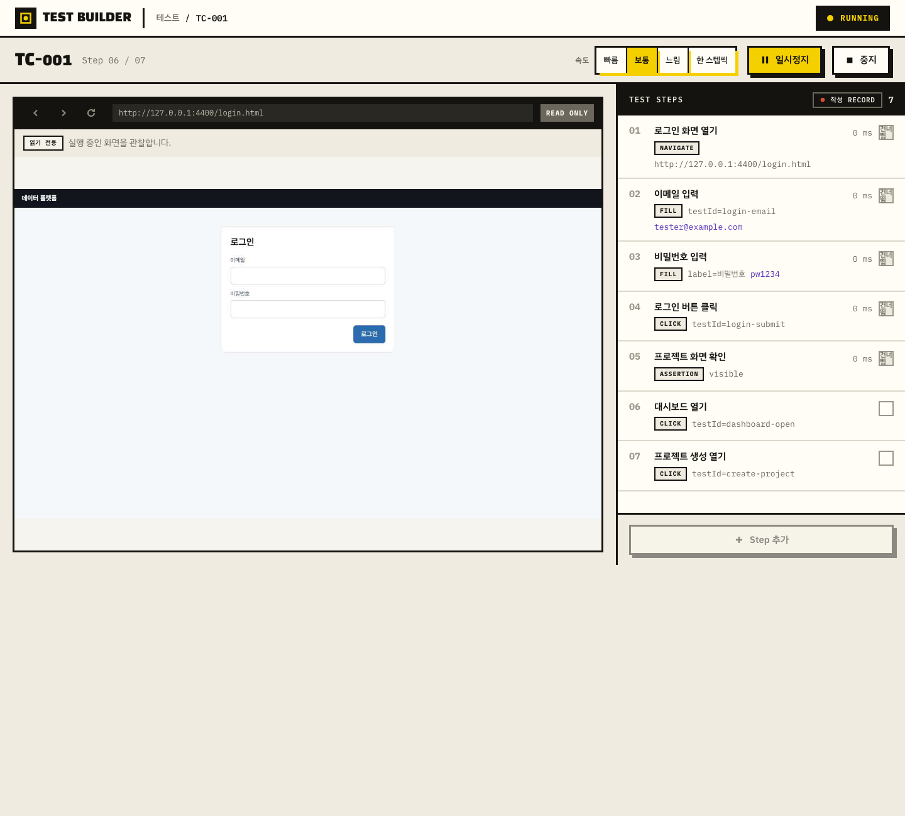 ·
  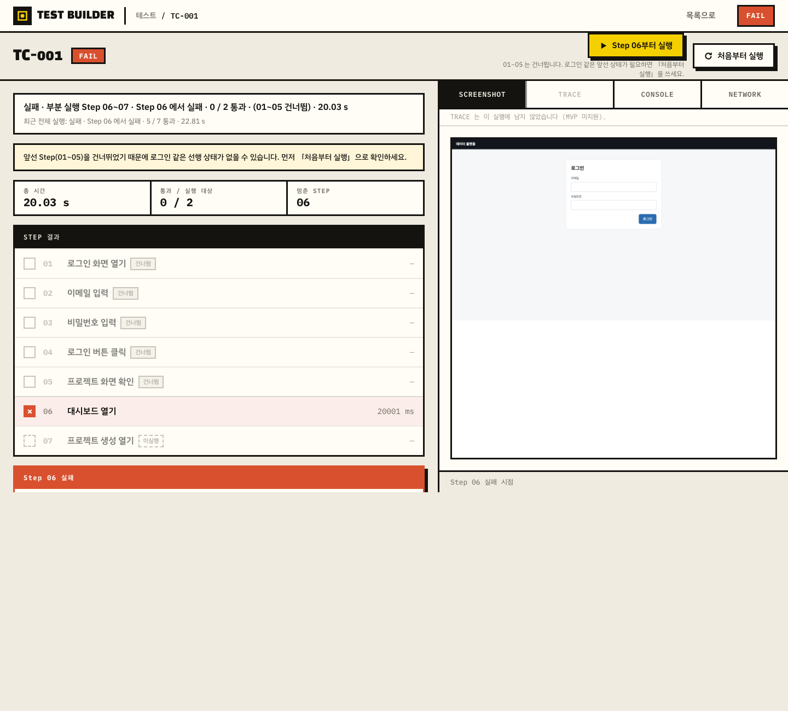

### U-03. 중지 — **부분 재발**

- **조작**: TC-001 실행 → Step 06(20초 대기) 진입 → 「중지」 1회.
- **해소된 것 (핵심)**
  - 「브라우저 세션이 유실됐습니다」 오류가 **사라졌다**.
  - 결과가 **FAIL 로 기록되지 않는다** — `GET /api/tests` 의 `outcome = "stopped"`,
    목록 상단 FAIL 카운트 **0**.
  - 요약이 「**중지 · Step 06 에서 중지 · 5 / 7 통과 · 2.94 s**」, 본문 「실행을
    중지했습니다.」 + 다음 행동 「처음부터 실행」「Step 06부터 실행」「목록으로」.
- **재발/미해소로 남은 것**
  1. **제목이 「TC-001 초안」** 이다. 저장된 테스트를 재실행했을 뿐인데 작성 중 초안으로
     보인다 (원 리포트 개선안 4 미반영). quickstart S2-3 은 「초안」 없음을 기대로 적었다.
  2. **세션 UUID 가 그대로 노출된다** — 경고 배너
     「세션을 찾을 수 없습니다: 5044d30354884c3f9c35feaf3f4bfa00 / 세션이 이미 끝났습니다.
     새 세션을 시작하세요.」 중지 직후 프론트가 `GET /api/sessions/{id}/tabs` 를 계속
     폴링해 **404 를 오류 배너로 띄우는 것**을 실측했다(응답 로그에 404 3건). 원 리포트
     개선안 5 미반영, quickstart S2-3 의 「세션 식별자 노출 없음」 미달.
  3. 하단에 **「테스트 이름」 입력칸 + 「저장」(비활성)** 저장 프롬프트가 여전히 뜬다.
     배지도 `REVIEW`(내부 상태명 영문 노출).
  4. 다음 행동 버튼이 **3개**다(quickstart 기대는 4개). 「결과 자세히 보기」가 없어 이
     화면에서 실패/중지 진단으로 바로 갈 수 없다.
- **증거**: 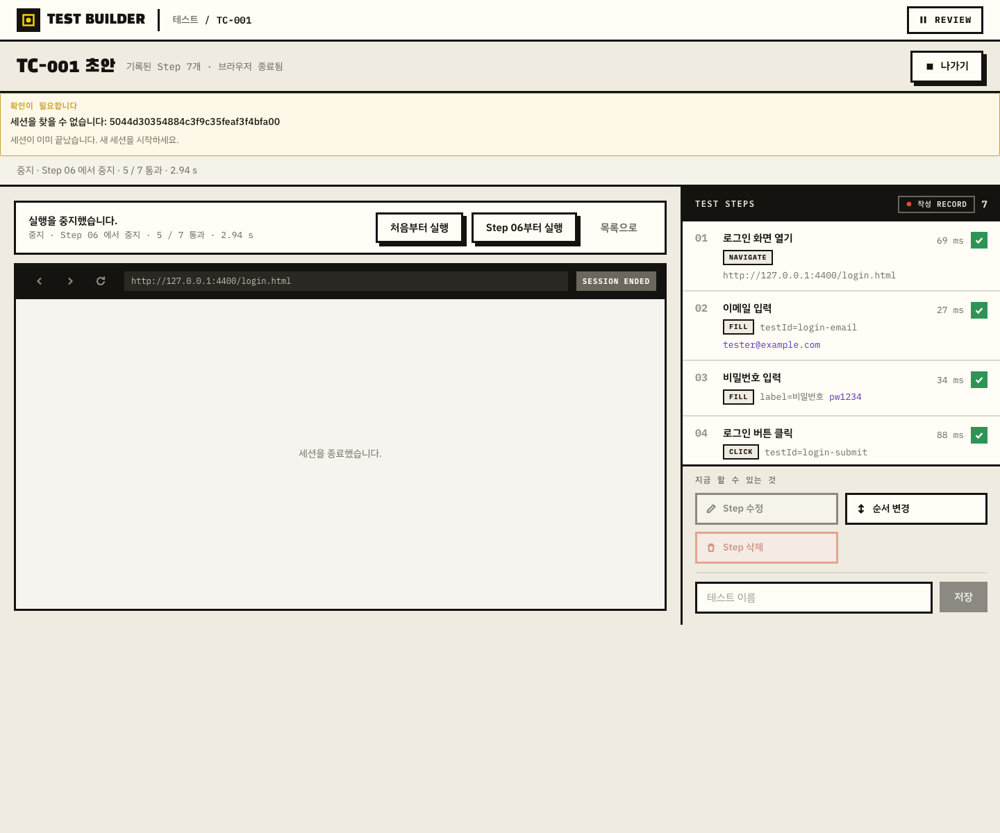
- **참고**: 「중지 중…」 전이 라벨은 **관찰하지 못했다**. 중지가 0.15초 안에 끝나 전이
  구간이 화면에 남지 않았다 — 결함으로 보지 않는다.

### U-04. 일시정지 — **부분 재발**

- **조작**: TC-001 실행 → Step 06 진입 → 「일시정지」 1회 → +0.3s / +3s / +8s / 종료까지 관찰.
- **해소된 것 (핵심)**
  - **+0.3초에 전이 상태가 보인다** — 배지 「**일시정지 중…**」, 부제
    「**현재 Step 이 끝나면 멈춥니다 · Step 06 대기 중 (최대 20s)**」. 10초를 기다리지
    않는다. 남은 대기 예산도 같이 나온다.
  - **편집 팔레트가 열리지 않는다** — 그 자리에 「정지되면 편집할 수 있습니다. 현재 Step 이
    끝나기를 기다리고 있습니다.」 안내 상자.
  - **전이 중에도 「중지」가 활성**이다. 「계속하기」는 비활성.
  - 실행이 끝난 뒤 배지가 「**실행 종료**」로 바뀌고 머리글이
    「**멈추기 전에 실행이 끝났습니다** · 실패 · Step 06 에서 실패 · 5 / 7 통과 · 22.81 s」.
    `PAUSED` 배지와 결말이 동시에 뜨는 일은 없어졌다.
- **재발/미해소로 남은 것**
  1. **낡은 배너가 지워지지 않는다.** 실행이 끝난 화면에 여전히
     「Step 하나가 10초 안에 끝나지 않아 **아직 실행 중입니다**. 그 Step 이 끝나면 멈춥니다
     — 지금 편집한 내용은 끝난 뒤의 목록에 적용됩니다.」가 남아 있다 (개선안 5 의
     "낡은 배너는 지운다" 미반영).
  2. **미리보기 오버레이가 상태와 어긋난다.** 전이 중(+0.3초)에도, 실행이 끝난 뒤에도
     미러 머리줄이 「**일시정지** 브라우저 세션과 화면 상태를 그대로 유지하고 있습니다.」
     라고 단정한다. 배지는 「일시정지 중…」 / 「실행 종료」인데 같은 화면 안에서 다른 말을
     한다 — U-04(a) "아직 아닌 것을 됐다고 말한다" 가 이 영역에 남아 있다.
  3. **「결과 자세히 보기」와 실패 사유 본문이 없다.** 요약 한 줄만 있어 일시정지를
     눌렀다는 이유로 진단 경로를 잃는 문제가 그대로다 (quickstart S3-4 기대 미달).
  4. 제목이 「TC-001 초안」 (U-03 잔존 1 과 같은 뿌리).
- **증거**: 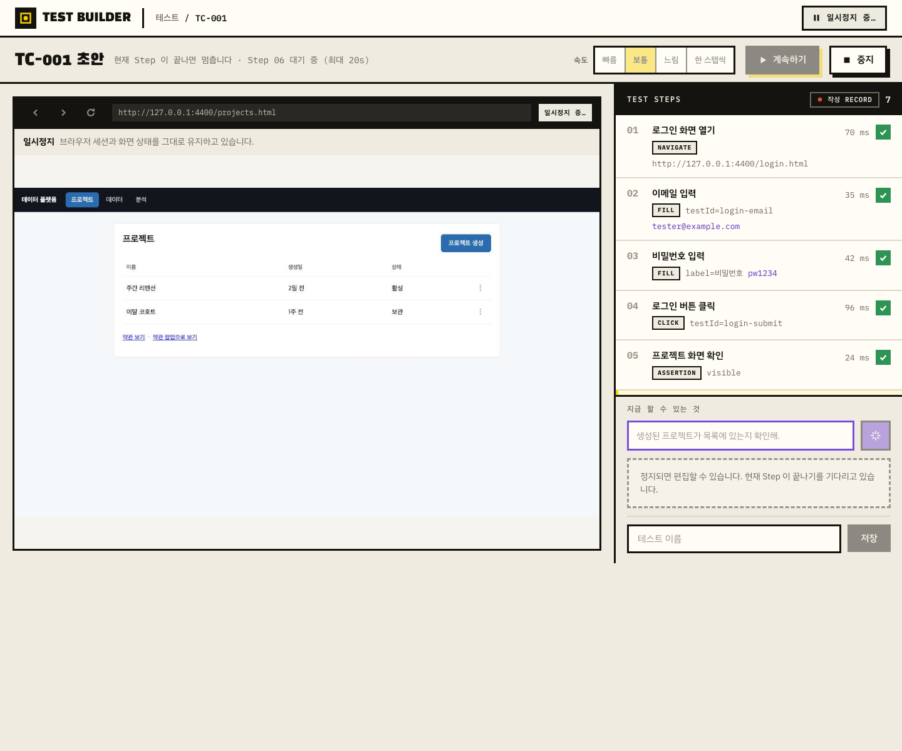 ·
  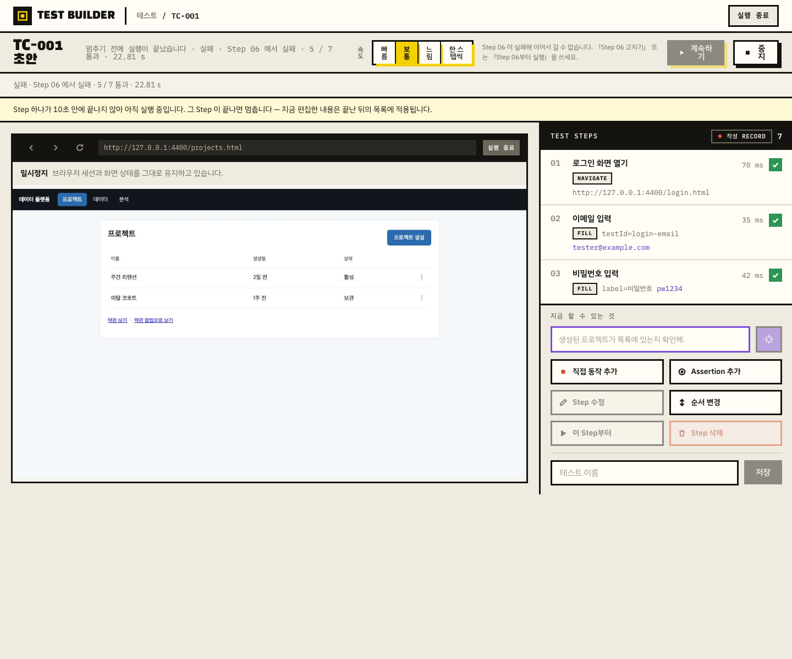

### U-05. 일시정지에서 「계속하기」 — **해소**

- **조작**: U-04 와 같은 상태(전이 중 실행이 실패로 끝난 세션)에서 「계속하기」를 확인.
- **관찰**: 「계속하기」가 **비활성**이고, 그 옆에 이유가 적혀 있다 —
  「**Step 06 이 실패해 이어서 갈 수 없습니다. 「Step 06 고치기」 또는 「Step 06부터 실행」을
  쓰세요.**」 실패 Step 을 조용히 건너뛰고 「완료」로 표시하는 경로는 사라졌다.
- **증거**: 
- **딸린 확인 불가**: quickstart S3-6 의 「실패한 Step 건너뛰고 계속」 → 결말 「부분 성공」은
  **걸 수 없었다**. 아래 「새로 본 것」 N-04 참조.

### U-06. 「처음부터 실행」 연타 — **해소**

- **조작 (a) 실제 클릭**: 결과 화면의 「처음부터 실행」 1회 클릭 후 +0.15초 화면.
  → 두 버튼 모두 **비활성 + 라벨 「실행을 준비하는 중…」**. 목록 행의 「실행」도 같은 방식으로
  +0.1초에 「준비 중…」 비활성이 된다(S1-1 통과).
- **조작 (b) 최악 조건**: `button.click()` 을 **한 JS 태스크 안에서 5회** 동기 호출해
  React 의 비활성 반영을 앞질렀다. → `POST /api/sessions` 5건이 나갔고 그중
  **201 정확히 1건, 409 4건**. 실제 브라우저 창은 **1개**만 떴고, 목록에 배너가 두 줄로
  뜨는 현상도 없었다. 백엔드 직렬화(FR-128)가 실제로 동작한다.
- **증거**: 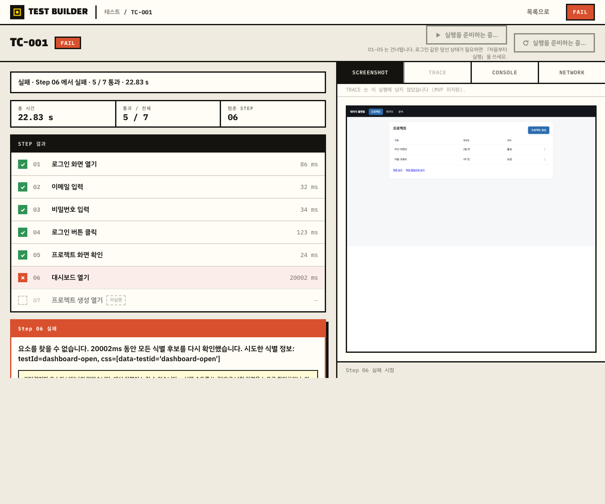 ·
  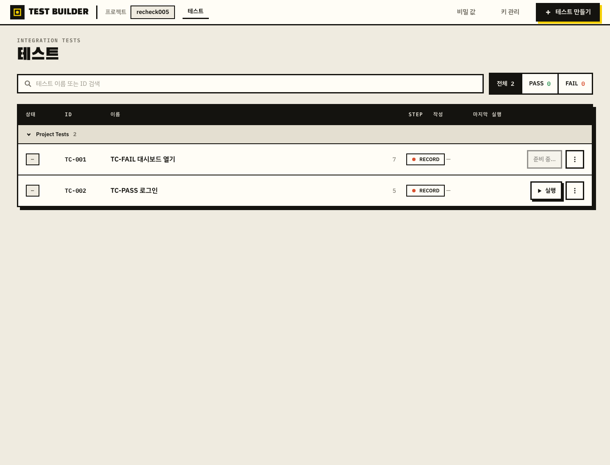 ·
  

### U-07. 목록의 실패 Step 번호 — **해소**

- **관찰**: 세 화면이 같은 번호를 낸다.
  - 목록 행: 「**Step 06** · 요소를 찾을 수 없습니다 … testId=dashboard-open」
  - 러너 요약: 「실패 · **Step 06** 에서 실패 · 5 / 7 통과」
  - 결과 화면: 「멈춘 STEP **06**」, Step 목록의 ✕ 도 06.
- **증거**: 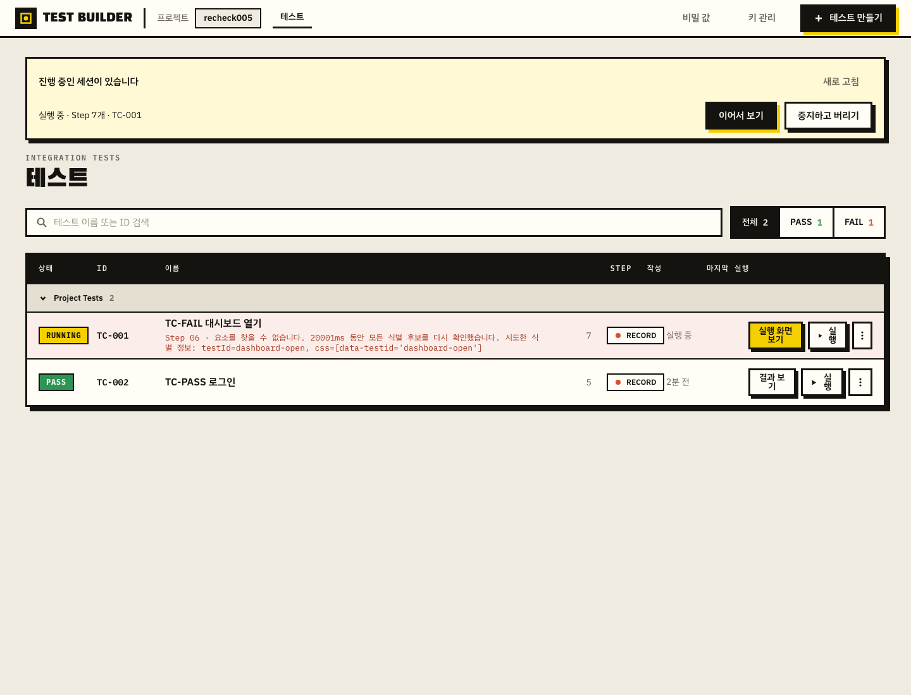 (행 요약) ·
   (결과 화면)

### U-08. 끝난 실행의 「중지」 — **해소**

- **조작**: TC-002(PASS) 실행 → 완료 화면 관찰 → 우상단 버튼 클릭.
- **관찰**
  - 라벨이 **「닫기」**로 바뀌었다. 강조(검은 배경·노란 그림자)가 없는 평범한 외곽선
    버튼이고, 「일시정지」와 속도 4버튼은 회색 비활성이다.
  - 누르면 **확인 대화상자**가 뜬다 — 「실행 화면을 닫습니다 / 결과는 목록의 「결과 보기」에서
    다시 볼 수 있습니다. / 돌아가기 · 닫기」. 이 시점까지 `discard` 요청은 나가지 않는다.
  - 완료 화면의 다음 행동은 「결과 자세히 보기」「처음부터 다시 실행」「목록으로」.
  - PASS 한 테스트의 결과도 목록 행의 **「결과 보기」**로 다시 열 수 있다(S1-7 통과).
- **증거**: 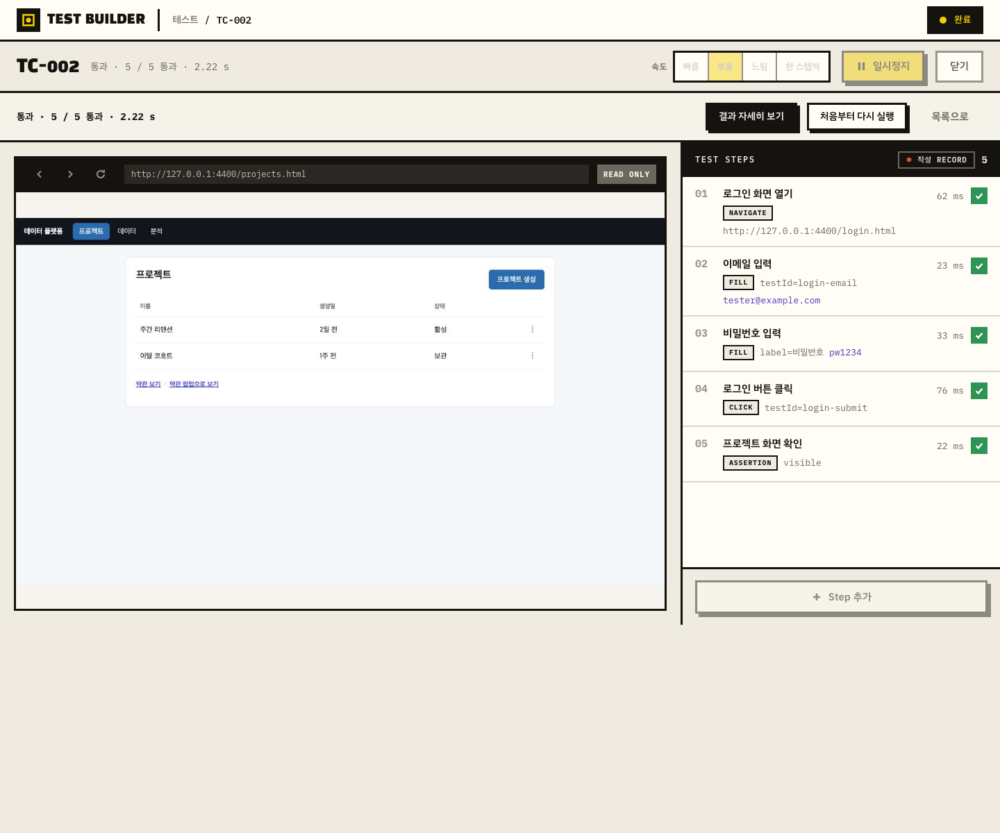 ·
  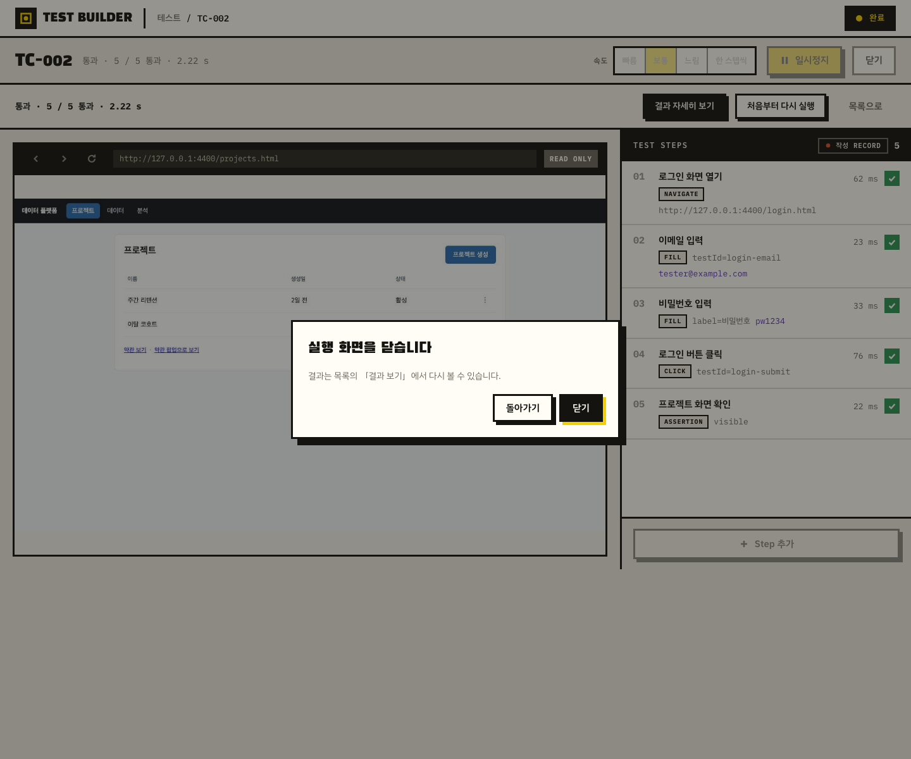

### U-24. 미리보기(미러) — **해소**

- **조작 (S6-1·2)**: 「테스트 만들기 → 녹화 시작」으로 **새 세션**을 만들고, 대상 화면을
  **전혀 건드리지 않은 채** 미리보기만 봤다. 대상 앱 첫 화면(login.html)은 정적이다.
- **관찰**: 클릭 후 **약 1초**(브라우저 기동 포함) 만에 미러에 로그인 화면이 그려졌다.
  「미러 프레임을 기다리고 있습니다」로 비어 있는 구간을 만들지 못했다.
- **S6-3 (오래 기다리는 Step)**: Step 06 의 20초 대기 내내 미러가 projects.html 을
  유지했다(U-04 관찰 화면이 그 증거다).
- **S6-4 (이탈 후 복귀)**: 목록으로 나갔다 「이어서 보기」로 돌아왔을 때 즉시 화면이 있었다.
- 읽기 전용 고지도 자리에 있다 — 「실제 브라우저 창에서 조작 중 / 이 영역은 관찰용이며 조작
  대상이 아닙니다.」 (FR-047a)
- **증거**: 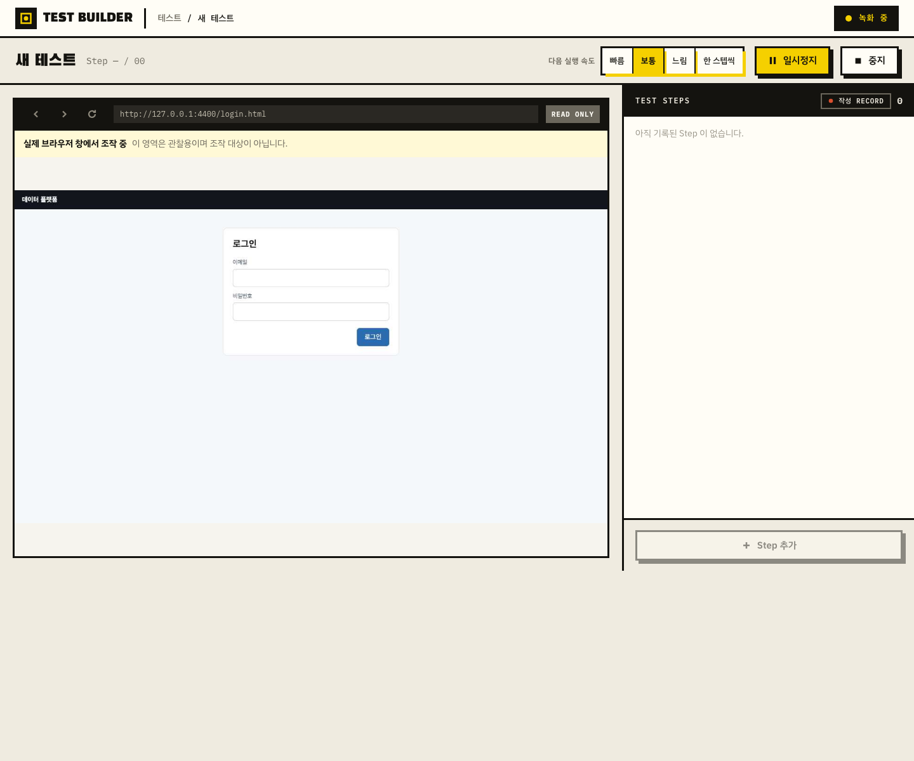 ·
  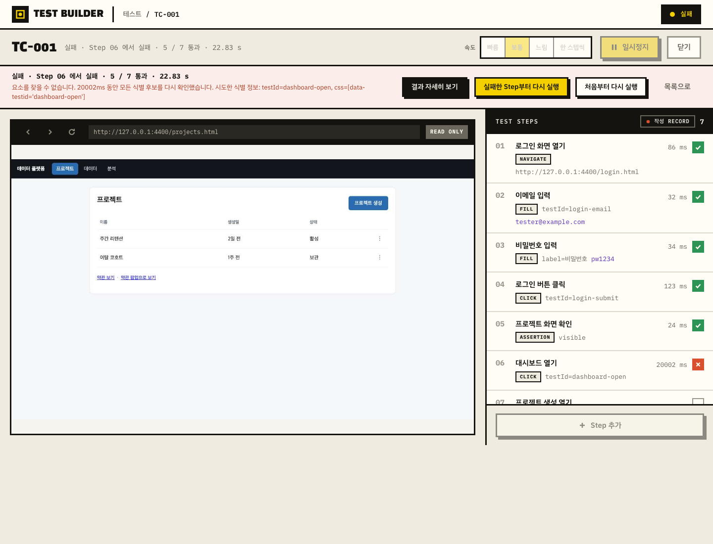

---

## 새로 본 것 (「상」 9건과 무관 · 판정과 분리)

### N-01. 새로고침이 화면 상태를 잃는다 — 결과 화면이 목록으로 튀고 URL 이 `/` 로 초기화된다

- **조작**: 결과 화면(`http://127.0.0.1:4410/?screen=result&test=TC-001`)에서 F5.
- **실제**: 목록 화면으로 돌아가고 **주소창까지 `http://127.0.0.1:4410/` 로 바뀐다.**
  러너 화면(`?screen=runner&session=…`)도 같다 — 새로고침하면 목록 + 배너로 떨어진다.
- 목록에 「실행 화면 보기」·「이어서 보기」 복귀 수단이 있어 막다른 길은 아니지만,
  quickstart S7-1 의 「같은 결과 화면으로 돌아오는지」와 FR-166/167(URL ↔ 화면 상태 양방향)은
  **충족되지 않는다.** 단위 테스트 `frontend/tests/ScreenUrl.test.ts` 8건은 통과하는데
  실제 새로고침에서는 복원되지 않는다 — 변환 함수와 그것을 부트스트랩에 연결하는 곳 사이에
  틈이 있어 보인다(원인은 **확인 필요**).
- 뒤로가기는 앱을 이탈하지 않는다(`about:blank` 로 가지 않음) — S7-2 는 통과.
- **증거**: 

### N-02. 끝난 세션이 열려 있는 동안 목록 행이 계속 「RUNNING · 실행 중」이라고 말한다

- **조작**: 실행 중 목록으로 나가 30초 이상 관찰.
- **실제**: 배너는 20초 안에 「실행 중 → **실패**」로 스스로 갱신됐다(S7-4 통과). 그런데
  **같은 화면의 행 배지는 `RUNNING`, 「마지막 실행」 칸은 「실행 중」** 그대로다. 30초가 지나도
  바뀌지 않았다. 배너와 행이 서로 다른 말을 한다.
- 중지(REVIEW) 세션에서도 같다 — 배너 「검토 중」, 행 배지 `RUNNING`.
- 백엔드를 재시작해 세션 등록이 비면 행이 곧바로 `FAIL`/`PASS` 로 정상 표시된다. 즉 행 배지가
  **저장된 결말이 아니라 열린 세션의 존재**를 보고 있다.
- **증거**: 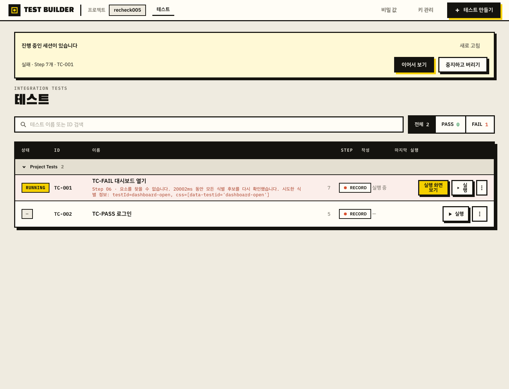

### N-03. 통과한 실행의 SCREENSHOT 탭이 오류 문구를 띄운다

- **조작**: TC-002(PASS) 결과 화면 → SCREENSHOT 탭.
- **실제**: 「**실패 시점 스크린샷 파일을 불러올 수 없습니다.** / 실행 산출물(.runs/)이
  지워졌을 수 있습니다. 다시 실행하면 새로 남습니다.」 통과한 실행에는 실패 시점 스크린샷이
  없는 것이 정상인데 산출물이 지워진 것처럼 말한다. quickstart S8-1 의 「빈 탭이 없다는
  사실을 **긍정문**으로」에 어긋난다.
- 덧붙여 「TRACE 는 이 실행에 남지 않았습니다 (MVP 미지원).」 안내줄은 **어느 탭을 골라도**
  탭 띠 아래에 항상 붙어 있다. TRACE 탭 비활성 이유 표시 자체는 의도대로 있다.
- **증거**: 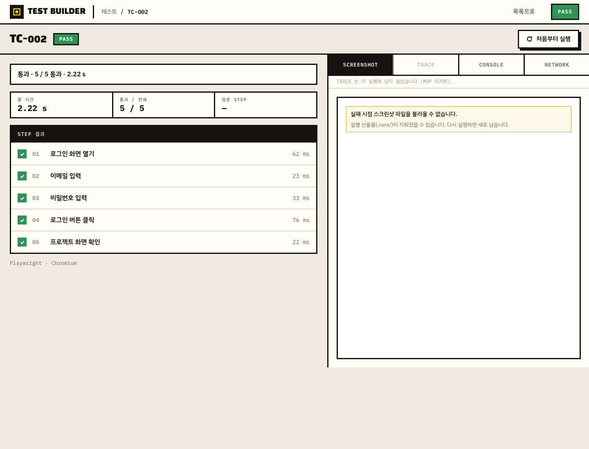

### N-04. 「실패한 Step 건너뛰고 계속」 컨트롤이 화면에 없다 — `partial_pass` 를 UI 로 만들 수 없다

- quickstart S3-6 은 이 버튼을 눌러 결말이 「부분 성공」인지 보라고 적어 두었다.
- 실패 Step 이 있는 일시정지 상태에서 「계속하기」는 비활성 + 이유(U-05 해소)까지 갔는데,
  그 옆에 **건너뛰기 버튼이 없다.** 프론트에서 `skip_failed` 를 보내는 곳도 없다
  (`grep -rn "skip_failed\|건너뛰고 계속" frontend/src` → 0건). 백엔드·계약에는 있다
  (`backend/src/itb/execution/runner.py:349`, `backend/src/itb/domain/run_result.py:189`).
- 따라서 **S3-6 은 확인 불가**다. 의도적으로 뺀 것인지, 남은 작업인지 **의도 확인 필요**.

### N-05. 결말·상태 어휘가 화면마다 한글/영문으로 갈린다

한 바퀴에서 본 것만 적는다. 러너 배지 「실패」「완료」「녹화 중」「실행 종료」「일시정지 중…」
(한글) ↔ 중지 후 배지 `REVIEW`, 녹화 일시정지 배지 `PAUSED`, 결과 화면 배지 `FAIL`/`PASS`,
목록 행 배지 `RUNNING`/`FAIL`/`PASS` (영문). 결과 화면 요약은 「통과 · 5 / 5 통과」인데 배지는
`PASS`, 러너 배지는 「완료」다 — 같은 실행을 세 단어로 부른다.

### N-06. 녹화 일시정지 부제가 없는 Step 번호를 말한다

Step 5개를 녹화하고 일시정지하면 부제가 「**Step 06 이후 정지**」다. 06 은 존재하지 않는다.
(「Step 05 이후 정지」 또는 「기록된 Step 5개」가 맞아 보인다.)
증거: 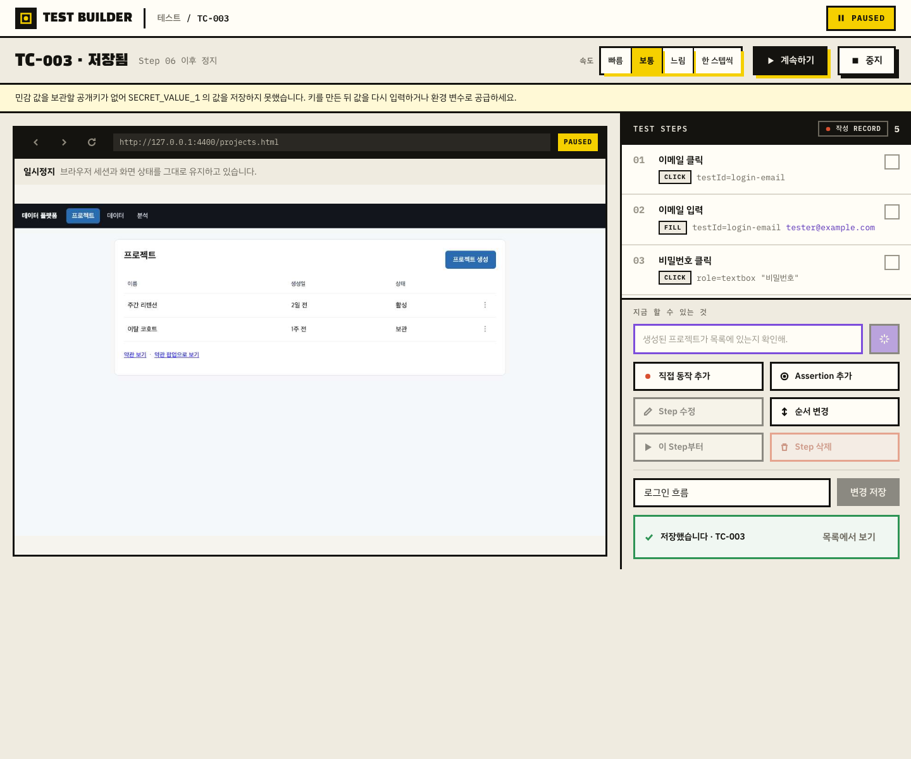

### N-07. `/api/health` 의 `bind` 가 실제 포트를 말하지 않는다

`--port 4420` 으로 띄운 서버가 `{"status":"ok","bind":"127.0.0.1:4320", …}` 를 돌려준다.
화면에 나오는 값은 아니지만 포트를 바꿔 띄웠을 때 진단을 오도한다.

---

## 곁가지 확인 (「상」 9건 대상 아님, 통과한 것)

- **S5 저장 (U-09·U-10)** — CDP 하니스로 로그인 흐름 5 Step 을 녹화하고 이름을 넣어 「저장」
  1회. `POST …/save` **1건**, 화면 이동 없이 초록 확인줄 「✓ 저장했습니다 · TC-003」과
  「목록에서 보기」가 뜨고, 제목이 「**TC-003 · 저장됨**」으로, 버튼이 「**변경 저장**」(비활성)
  으로 바뀐다. 「초안」이 남지 않는다.
  → 같은 화면 부품이 **재실행 세션에서는 「TC-001 초안」**을 쓰는 것이 U-03·U-04 의 잔존
  1번이다. 저장 경로만 고쳐졌다.
  
- **S8-2 속도 라벨** — 녹화 중 헤더 라벨이 「**다음 실행 속도**」다.
- **S7-5** — 끝난 세션을 「이어서 보기」로 다시 열면 Step별 ✓ 와 소요시간이 남아 있다.
- **S7-4** — 목록 배너가 25초 안(실측 20초)에 스스로 「실행 중 → 실패」로 갱신된다.
- **민감 값** — 녹화 시 비밀번호 필드가 자동으로 민감 처리되어 Step 값이 `{{SECRET_VALUE_1}}`
  로 저장되고, 공개키가 없을 때 「민감 값을 보관할 공개키가 없어 SECRET_VALUE_1 의 값을
  저장하지 못했습니다」로 알린다. 평문 노출은 보지 못했다.

## 미검증

| 항목 | 사유 |
|---|---|
| S3-6 「실패한 Step 건너뛰고 계속」 → 「부분 성공」 | UI 컨트롤이 없어 경로에 도달 불가 (N-04) |
| AI 작성·사람 인수 | 언어모델 자격 증명 없음 (「AI로 만들기」가 그 사실을 화면에서 알려 준다) |

## 남은 작업으로 등록할 것 (quickstart §4 기준)

재발한 U 번호를 조용히 넘기지 않는다.

1. **U-03-a** 재실행 세션 제목의 「초안」 제거 + 중지 후 저장 프롬프트 대신 중지 결과 화면
2. **U-03-b** 종료 세션 폴링 404 를 오류 배너로 띄우지 않기 + 세션 UUID 비노출
3. **U-04-a** 실행이 끝나면 일시정지 전이 배너 제거
4. **U-04-b** 미러 오버레이 문구를 실제 상태(일시정지 중 / 실행 종료)와 맞추기
5. **U-04-c** 「멈추기 전에 실행이 끝났습니다」 화면에 실패 사유 + 「결과 자세히 보기」 붙이기

---

## 처리 결과 (2026-09-07 · 005 Phase 12 · T112~T122)

위에 등록한 11건을 닫았다. 코드 수정과 회귀 고정은
[tasks.md](../../specs/005-ux-walkthrough-repair/tasks.md) Phase 12 에 항목별로 적었고,
여기에는 **재점검이 무엇을 배웠는지**만 남긴다.

### 부분 재발 2건의 공통 원인

U-03·U-04 의 곁가지는 전부 같은 형태였다 — **고친 곳 옆에 같은 사실을 말하는 다른 곳이
있었다.** 배지는 고쳐지고 부제는 남았고, 저장 경로는 고쳐지고 재실행 경로는 남았고,
`work_of` 는 고쳐지고 `tabs.py` 는 남았다.

한 번의 수정이 한 자리만 고치는 것이 문제였고, 그래서 이번 수정은 **문구와 판정을 한 곳으로
모으는 쪽**을 골랐다. `wording.ts` 에 `sessionTitle()`·`pausedAfterLabel()`·`mirrorNotice()`,
신규 `sessionState.ts` 에 `isRunning()`. 한 줄을 고쳐 증상을 없애는 것보다 비용이 크지만,
증상이 하나 남았을 때 그것이 마지막인지 알 수 있다.

### 재점검이 새로 알려 준 것

**N-04 는 결함이 아니라 빠진 작업이었다.** 「실패한 Step 건너뛰고 계속」은 FR-137·
ui-contract §6-5·quickstart §3-6 이 모두 요구하고 백엔드(`skip_failed`)도 서 있었는데,
그것을 보내는 화면 작업이 tasks.md 에 **없었다**. 계약과 백엔드만 있으면 "구현했다" 로
보이고 자동 테스트도 통과한다 — 그 절반은 사람이 걸어야 드러난다. 이것이 T110·T092 같은
수동 검증을 자동 테스트로 대체할 수 없는 이유의 구체적인 사례다.

**AS-027 은 결함에 기대어 통과하고 있었다.** 「이미 종료된 세션에 조작을 보낸다」 시나리오는
화면의 오류 배너를 근거로 통과했는데, 그 배너의 출처는 그 조작이 아니라 U-03-b 가 지적한
탭 404 였다. 그 배너를 없애자 시나리오가 깨졌고, 실제 처리(화면이 조작을 거두어 간다)는
더 강한 것이었다. **이상 조작 테스트는 "무엇이 떴는가" 가 아니라 "어느 통로로 떴는가" 를
봐야 한다** — 그러지 않으면 결함이 테스트를 지탱한다.

### 이번에도 사람이 걸어야 하는 것

| 항목 | 지금 상태 |
|---|---|
| S3-6 「실패한 Step 건너뛰고 계속」 → 「부분 성공」 | **컨트롤을 만들었다.** 결말이 실제로 `partial_pass` 로 저장되는지는 사람이 걸어 확인한다 |
| N-05 결말·상태 어휘의 한글/영문 갈림 | 005 범위 밖 (위 「005 범위 밖」 절) |
| N-07 `/api/health` 의 `bind` | 005 범위 밖 |
| AI 작성·사람 인수 | 언어모델 자격 증명 없음 |
