# UX 워크스루 — 2026-09-04

## 요약

ITB 를 처음 쓰는 사용자로서 격리된 환경(전용 포트 4400/4411/4420, `XDG_*` 분리)에 제품을
띄우고 S1~S10 을 직접 걸었다. **시나리오 10건 중 9건 수행, 1건(S6 AI 성공 경로) 미검증.
발견 33건 — 상 9 / 중 14 / 하 10.**

가장 아픈 것은 세 가지다. 첫째, **문서에 적힌 유일한 실행 방법(`npm run dev` + 백엔드)으로
띄우면 실시간 채널이 연결되지 않아 녹화한 Step 이 화면에 하나도 나타나지 않는다** — 서버는
정상 기록 중인데 화면은 "아직 기록된 Step 이 없습니다" 라고 말한다. 둘째, **실행이 실패해도
그 화면에서는 원인도, 결과 화면으로 가는 길도 없다** — 원인은 목록으로 되돌아가야 겨우
보이고, 정작 증거 탭(스크린샷·콘솔·네트워크)은 전부 내용 대신 파일 경로나 깨진 이미지를
보여준다. 셋째, **새로고침 한 번이면 저장 안 된 녹화가 통째로 사라지고**, 살아 있는 세션은
화면 어디에도 흔적이 남지 않아 되찾을 수 없다.

반대로 비밀값 처리, 일시정지·편집·계속하기(원칙 III), Locator 후보 공개, 위험 조작 확인
문구는 매우 잘 만들어져 있다. 아래 「잘 된 점」에 남긴다.

---

## 걸은 범위

| 시나리오 | 수행 | 조작 방법 | 비고 |
|---|---|---|---|
| S1 첫 실행 | O | 프론트 직접 | |
| S2 프로젝트 만들기·열기 | O | 프론트 직접 | 열기 실패(U-08)로 데이터 위치를 홈 아래로 옮겨 재수행 |
| S3 직접 녹화 | O | CDP 하니스 + 프록시 하니스 | 하니스 영향 있음 — U-01 참조 |
| S4 재실행·실패 진단 | O | 프론트 직접 | |
| S5 Pause → Edit → Resume | O | CDP 하니스 | 하니스 영향 가능성 없음 |
| S6 AI 로 작성 | △ | 프론트 직접 | 「AI 실행」이 시작되지 않음(U-07). **성공 경로 미검증** |
| S7 사람 인수 | △ | CDP 하니스 | 인수 전환은 확인, 인수 후 Step 기록 0건 — 판단 보류 |
| S8 Locator 상세 | O | 프론트 직접 | 정의 보기 · 결과 화면 후보 목록 |
| S9 비밀값·키 | O | 프론트 직접 | 키 교체·삭제는 **의도적으로 수행하지 않음**(U-09) |
| S10 어긋난 상황 | O | 프론트 직접 + CDP | 앱 죽음 / 잘못된 URL / 서버 재시작 / 창 닫힘 4종 |

### 하니스 사용 고지

- **CDP 하니스**: 백엔드가 띄우는 Chromium 에 `--remote-debugging-port=9333` 만 덧붙여
  기동했다. 제품 로직 무수정. 녹화·인수 국면의 "실제 브라우저 조작" 에 썼다.
- **프록시 하니스**: 제품 `frontend/vite.config.ts` 의 `/api` 프록시에 `ws: true` 만 더한
  설정 파일을 별도로 만들어 4411 포트로 UI 를 띄웠다. **이 하니스가 없으면 S3 이후를
  전혀 걸을 수 없다는 사실 자체가 U-01 이다.** S3 의 첫 시도(4410, 제품 설정 그대로)와
  두 번째 시도(4411, 하니스)를 모두 기록했다.
- 환경: 사용자의 4300·4310·4320 서버는 건드리지 않았고, `~/.local/share/itb`·
  `~/.config/itb` 의 데이터도 쓰지 않았다. 단, 비밀키만은 제품이 `~/.config/itb/keys` 를
  **읽어** 썼다(U-09). 쓰기·교체·삭제는 하지 않았다.

---

## 발견

### U-01. 문서에 적힌 방법으로 띄우면 녹화한 Step 이 화면에 하나도 안 나온다 — 영향도: 상 | 화면: 녹화 | 시나리오: S3

- **하려던 것**: 대상 앱에서 로그인 흐름을 녹화해 테스트로 저장한다.
- **기대**: 클릭·입력할 때마다 오른쪽 TEST STEPS 에 Step 이 쌓인다.
- **실제**: 이메일 클릭 → 입력 → 비밀번호 클릭 → 입력 → 로그인 클릭까지 실제 브라우저에서
  다 했는데 화면은 끝까지 `step 00 / 00`, "아직 기록된 Step 이 없습니다.", 미러 영역은 회색
  공백이었다. 서버에 물어보니 **5개가 정상 기록되어 있었다.** 화면에는 연결이 끊겼다는 표시도,
  재연결 버튼도, 아무 경고도 없었다.
- **증거**: 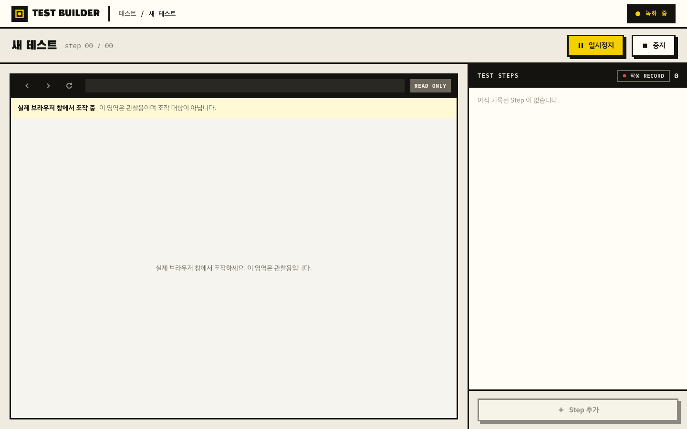
  콘솔에는 `WebSocket connection to 'ws://127.0.0.1:4410/api/sessions/<id>/events' failed`.
  같은 URL 로 백엔드 포트에 직접 붙으면 `open`, vite 프록시를 거치면 `timeout`.
  원인: `frontend/vite.config.ts:16` 의 프록시가 `"/api"` 에는 `ws` 옵션이 없고, `ws: true`
  는 클라이언트가 쓰지 않는 `"/ws"` 경로에 붙어 있다. 클라이언트 접속 경로는
  `frontend/src/api/ws.ts:114` 의 `/api/sessions/${sessionId}/events`.
  `README.md:90,93` 이 안내하는 실행 방법(백엔드 4320 + `npm run dev` 4310)이 정확히 이 경로다.
  백엔드는 UI 를 서빙하지 않으므로(`/` 404) 이 경로 말고 화면을 여는 방법이 없다.
- **왜 문제인가**: 첫 사용자가 처음 하는 일이 녹화다. 다 하고 나서 "아무것도 기록되지 않았다"
  를 보면 제품이 고장 난 것으로 판단하고 그 자리에서 이탈한다. 실제로는 다 기록되어 있다.
- **개선 방향**: (1) `vite.config.ts` 의 `/api` 프록시에 `ws: true` 를 더하고 쓰이지 않는
  `/ws` 항목을 정리한다. (2) 그와 별개로 **실시간 연결이 끊기면 화면이 말하게 한다** —
  상단에 「실시간 연결이 끊겼습니다. Step 은 서버에 계속 기록되고 있습니다.」 + 「다시 연결」
  버튼. 지금은 조용히 실패한다.
- **손대는 범위**: `frontend/vite.config.ts` 1줄 + 연결 상태 표시(소~중) · **제약 확인**: 저촉 없음

---

### U-02. 실행이 끝난 화면이 실패 이유도, 다음 갈 곳도 알려주지 않는다 — 영향도: 상 | 화면: 실행(RunView) | 시나리오: S4

- **하려던 것**: 저장한 테스트를 다시 돌리고 실패 원인을 읽는다.
- **기대**: 실패한 Step 옆에 왜 실패했는지가 있거나, 최소한 「결과 보기」로 가는 버튼이 있다.
- **실제**: 상단에 `FAIL · 3 / 5 통과 · 0.23 s`, Step 04 에 빨간 ✕ 만 찍힌다. **이유는 한 글자도
  없다.** 화면의 버튼은 「일시정지」(비활성) 「중지」 「Step 추가」(비활성) 뿐이다. 결과 화면으로
  가는 링크도, 다시 실행하는 버튼도 없다. 실패한 Step 을 눌러도 아무 일도 없다.
  서버는 이때 이미 아주 구체적인 이유를 갖고 있었다(민감 변수 복호화 실패 + 해결 방법 3가지).
- **증거**: 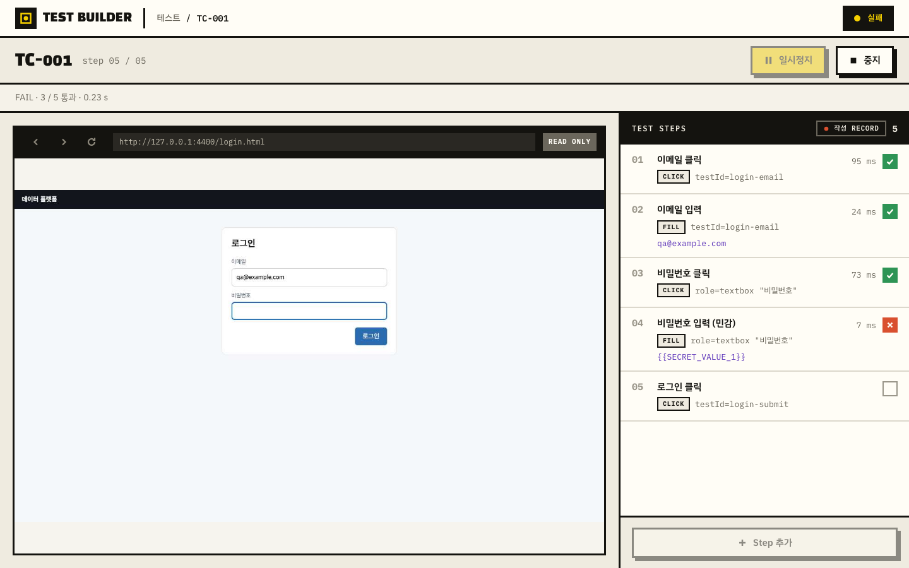
- **왜 문제인가**: 사용자는 실행이 끝난 그 화면에 서 있다. 거기서 아무 길도 주지 않으면
  브라우저 뒤로가기나 새로고침을 누르게 되고, 새로고침하면 목록으로 튕긴다(U-05 와 결합).
  "1분 안에 원인 파악"(SC-009)이 이 화면에서는 성립하지 않는다.
- **개선 방향**: 실행 종료 시 상단 요약줄(`FAIL · 3/5 통과`) 아래에 실패 이유 한 줄과
  기본 버튼 3개를 둔다 — 「결과 자세히 보기」 「실패한 Step부터 다시 실행」 「목록으로」.
  결과 화면(U-03 참조)에 이미 이 요소들이 다 있으므로 재사용하면 된다.
- **손대는 범위**: 실행 화면 하단 액션 바(소) · **제약 확인**: 저촉 없음

---

### U-03. 증거 탭(스크린샷·콘솔·네트워크)이 내용 대신 파일 경로와 깨진 이미지를 보여준다 — 영향도: 상 | 화면: 결과 보기 | 시나리오: S4

- **하려던 것**: 실패 시점 화면과 콘솔 로그를 본다.
- **기대**: SCREENSHOT 탭에 실패 순간 스크린샷, CONSOLE 탭에 로그 본문.
- **실제**: SCREENSHOT 탭은 `alt="step 04 실패 시점"` 만 남은 **깨진 이미지 아이콘**.
  CONSOLE·NETWORK 탭은 넓은 빈 패널 한가운데 `.runs/TC-001/console.log` 라는 **상대 경로
  문자열 한 줄**만 있다. 클릭할 수도, 복사 버튼도 없다. TRACE 는 비활성(의도된 범위 밖).
  실제 파일(`failure.png`, 1280×720 PNG)은 디스크에 정상적으로 있었다.
  `/api/tests/TC-001/result/artifacts/screenshot` 이 이미지 바이트가 아니라
  `{"kind":"screenshot","path":".runs/TC-001/failure.png"}` 라는 JSON 을 돌려준다.
- **증거**: 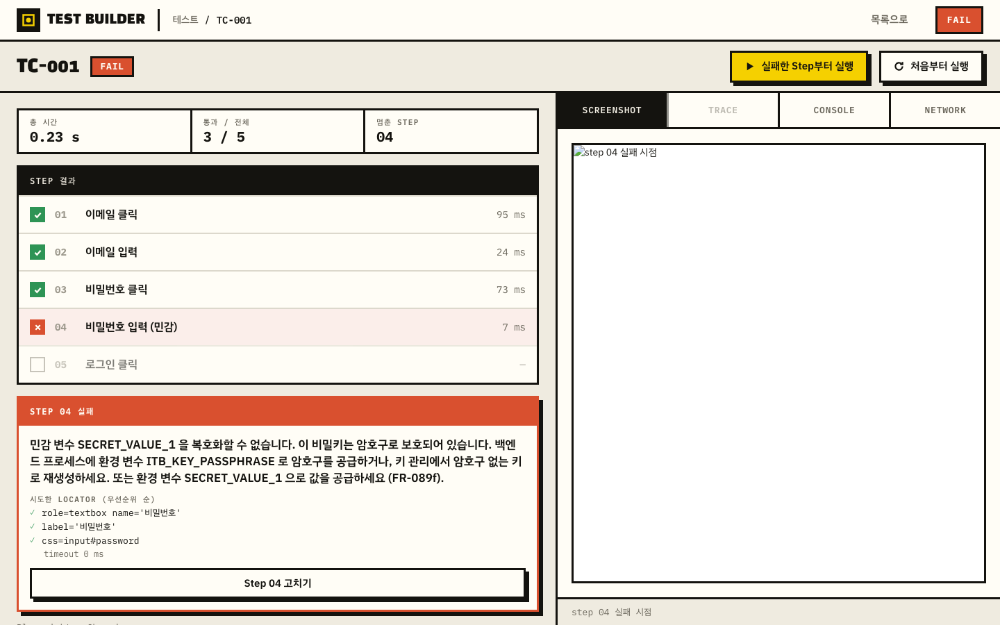
  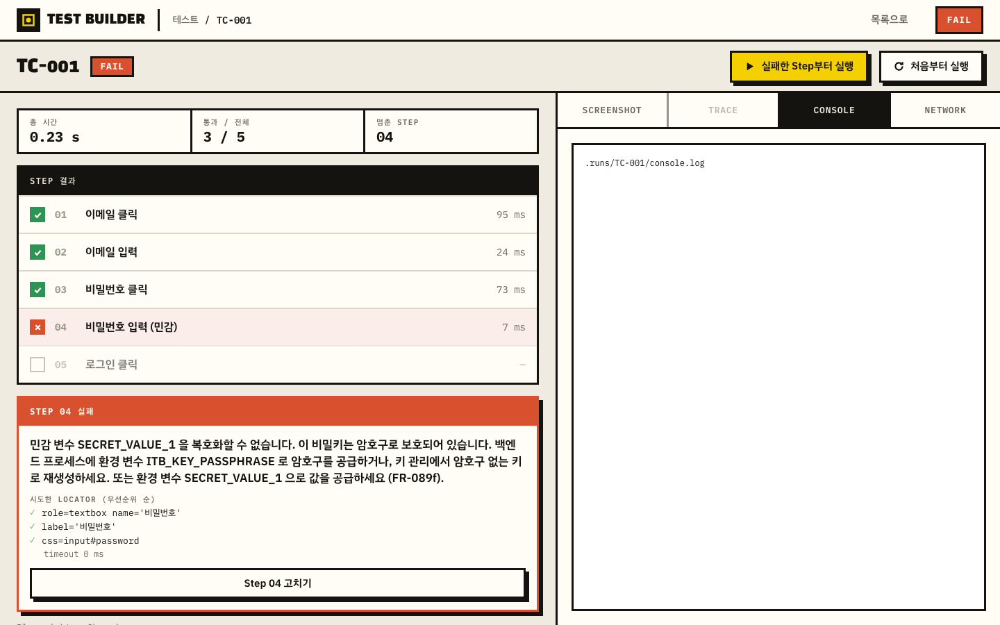
  관련 코드 `frontend/src/api/client.ts:198`
- **왜 문제인가**: 결과 화면의 나머지는 아주 잘 만들어져 있는데(Step 결과·실패 사유·Locator
  후보), 정작 눈으로 확인하는 증거만 전부 죽어 있다. 사용자는 프로젝트 폴더 절대 경로를
  따로 기억해 파인더로 찾아 들어가야 한다.
- **개선 방향**: 아티팩트 엔드포인트가 실제 바이트를 `Content-Type` 과 함께 돌려주게 하고
  (스크린샷=image/png, 로그=text/plain), 로그 탭은 본문을 코드 블록으로 렌더링한다.
  최소 조치로도 **경로 옆에 「폴더에서 열기」·「경로 복사」** 는 있어야 한다.
- **손대는 범위**: 백엔드 아티팩트 라우트 + 프론트 탭 렌더링(중) · **제약 확인**: 저촉 없음

---

### U-04. 대상 앱이 안 뜨면 "예상하지 못한 오류가 발생했습니다. 서버 로그를 확인하세요." — 영향도: 상 | 화면: 실행·테스트 만들기 | 시나리오: S10

- **하려던 것**: (a) 대상 앱을 내린 채 테스트를 다시 돌린다. (b) 열리지 않는 주소로 녹화를 시작한다.
- **기대**: 「http://127.0.0.1:4400 에 연결할 수 없습니다. 대상 앱이 떠 있는지 확인하세요.」
- **실제**: 두 경우 모두 화면 맨 위에 작은 분홍 띠로 **「예상하지 못한 오류가 발생했습니다.
  서버 로그를 확인하세요.」** 만 뜬다. 어느 주소인지, 무엇이 예상 밖이었는지 한 마디도 없다.
  녹화 시작의 경우 응답이 HTTP 500 이고, **입력해 둔 시작 URL 이 초기화되어 사라진다.**
  실행의 경우 오류 띠 아래에는 **직전 실행의 옛 결과가 그대로 남아 있어** 방금 누른 실행의
  결과처럼 읽힌다. 서버 로그의 실제 원인은 `net::ERR_CONNECTION_REFUSED at
  http://127.0.0.1:4400/login.html` 로 완전히 특정 가능한 상황이었다.
- **증거**: 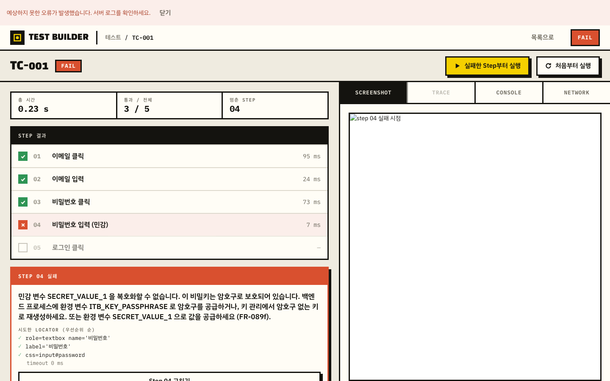
  관련 코드 `backend/src/itb/execution/session.py:387` (`await page.goto(start_url)`)
- **왜 문제인가**: "대상 앱이 안 떠 있다"는 이 도구에서 **가장 흔한 첫 실패**다. 그런데 가장
  다루기 어려운 메시지를 준다. 단독 로컬 도구 사용자에게 "서버 로그를 확인하세요"는
  터미널로 나가라는 뜻이고, 대부분은 거기서 멈춘다.
- **개선 방향**: 세션 생성 시 `page.goto` 의 네비게이션 오류를 잡아 전용 오류로 바꾼다 —
  코드 `TARGET_UNREACHABLE`, 문구 「대상 앱에 연결할 수 없습니다: http://127.0.0.1:4400/login.html」,
  next_action 「대상 앱이 실행 중인지, 주소와 포트가 맞는지 확인한 뒤 다시 시도하세요.」
  그리고 **실패해도 입력한 시작 URL 을 지우지 말 것.** 실행 화면 쪽은 오류 발생 시 이전
  결과를 흐리게 하거나 「이 결과는 이전 실행의 것입니다」를 덧붙인다.
- **손대는 범위**: 세션 생성 오류 매핑(소) + 폼 상태 보존(소) · **제약 확인**: 저촉 없음

---

### U-05. 새로고침 한 번에 저장 안 된 녹화가 통째로 사라지고, 살아 있는 세션은 되찾을 수 없다 — 영향도: 상 | 화면: 전역 | 시나리오: S3·S10

- **하려던 것**: 녹화 도중(또는 리뷰 화면에서) 화면을 새로 고친다.
- **기대**: 「진행 중인 녹화가 있습니다. 이어서 하시겠습니까?」 정도의 복귀 경로.
- **실제**: 아무 확인 없이 **테스트 목록으로 떨어진다.** 목록에는 "아직 테스트가 없습니다"
  라고만 쓰여 있다. 그런데 서버에는 `state: recording`, `steps: 5`, `has_unsaved_changes: true`
  세션이 그대로 살아 있고 실제 Chromium 창도 떠 있다. 화면 어디에도 그 세션으로 돌아가는
  링크가 없다. `GET /api/sessions` 는 목록을 지원하지 않아 세션 id 를 알아낼 방법도 없다.
  그 상태에서 새 녹화를 시작하면 **경고 없이 두 번째 세션과 두 번째 브라우저 창이 열리고**,
  앞의 5개는 영원히 못 찾는다. 반대로 테스트를 다시 실행하려 하면
  「TC-001 에 이미 실행 중인 세션이 있습니다. 먼저 중지하세요.」 라고만 하고 **중지할 버튼을
  아무 데도 주지 않는다.**
- **증거**: 리뷰 화면(Step 5개 보존됨) → 새로고침 → 빈 목록.
  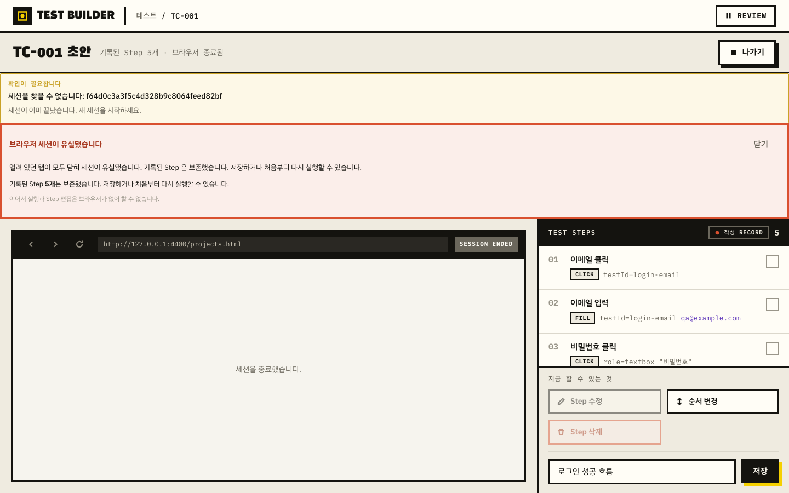 의 상태에서 새로고침하면 전부 사라진다.
- **왜 문제인가**: 데이터 손실이다. 그리고 브라우저에서 새로고침은 사용자가 막혔다고 느낄 때
  가장 먼저 누르는 키다(U-01·U-02 가 그 상황을 만든다).
- **개선 방향**: (1) 저장 안 된 Step 이 있는 동안 `beforeunload` 로 이탈을 확인한다.
  (2) 목록 화면 최상단에 **진행 중 세션 배너** — 「녹화 중인 세션이 있습니다 (Step 5개) ·
  [이어서 하기] [중지하고 버리기]」. (3) `GET /api/sessions` 로 활성 세션 목록을 돌려준다.
  (4) 새 세션 시작 시 기존 세션이 있으면 그 사실을 먼저 알린다.
- **손대는 범위**: 세션 목록 API + 목록 화면 배너 + 이탈 가드(중) · **제약 확인**: 저촉 없음

---

### U-06. 저장에 성공해도 화면이 그대로여서 저장됐는지 알 수 없다 — 영향도: 상 | 화면: 리뷰 | 시나리오: S3

- **하려던 것**: 녹화한 5개 Step 에 이름을 붙여 저장한다.
- **기대**: 「저장했습니다」 또는 저장된 테스트 화면·목록으로의 이동.
- **실제**: 「저장」을 누르면 3초 뒤에도 **같은 화면**이다. 제목은 여전히 `TC-001 초안`,
  상단의 노란 「확인이 필요합니다」와 빨간 「브라우저 세션이 유실됐습니다」 경고가 그대로 남아
  있고, 「저장」 버튼도 계속 눌리는 상태다. 바뀐 것은 브레드크럼이 `새 테스트` → `TC-001`
  로 변한 것뿐인데, 화면 상단 왼쪽 작은 글씨라 눈에 들어오지 않는다.
  파일은 정상 저장되어 있었다(`tests/TC-001-로그인-성공-흐름.yaml`).
- **증거**: 
- **왜 문제인가**: 오해 유발. 사용자는 저장이 실패했다고 보고 다시 누르거나, 경고 배너를
  저장 실패의 증거로 읽는다.
- **개선 방향**: 저장 성공 시 (a) 제목의 "초안" 을 떼고 (b) 「저장했습니다 · TC-001」 확인
  문구를 그 자리에 띄우고 (c) 상단 경고 배너를 닫고 (d) 기본 버튼을 「목록으로」로 바꾼다.
- **손대는 범위**: 리뷰 화면 저장 후 상태(소) · **제약 확인**: 저촉 없음

---

### U-07. 「AI로 만들기」에서 AI 실행을 누르면 지시문이 사라지고 「작성 RECORD」 일시정지 화면으로 떨어진다 — 영향도: 상 | 화면: AI 작성 | 시나리오: S6·S7

- **하려던 것**: 자연어로 지시해 테스트를 만든다.
- **기대**: AI 가 브라우저에서 동작을 시도하고, 성공한 것이 Step 으로 쌓인다.
- **실제**: 「지시문 쓰기」 → 지시문 입력 → 「AI 실행 →」 클릭. 4초 안에 화면 전체가 바뀌어
  **PAUSED 상태의 직접-녹화 화면**이 되고, 오른쪽 모드 배지는 `작성 RECORD`, Step 0개,
  미러에는 「일시정지 중입니다. 마지막 화면을 기다리고 있습니다.」가 40초 넘게 그대로 있었다.
  **내가 쓴 지시문은 화면에서 사라졌다.** 이 사이 백엔드로 나간 요청은 `POST /api/sessions`
  하나뿐 — `ai-step` 은 한 번도 호출되지 않았다. 서버 쪽 세션은 `authoring_mode: "ai"`,
  `state: "paused"` 인데 화면은 `RECORD` 라고 표시한다.
  `GET /api/ai/availability` 는 `{"available": true}` 였다.
- **증거**: 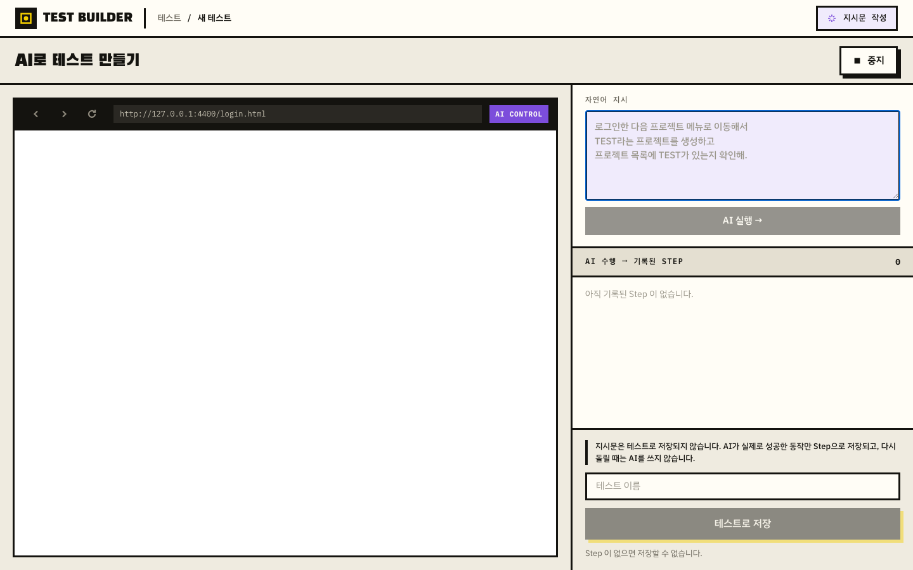
  → 실행 4초 뒤 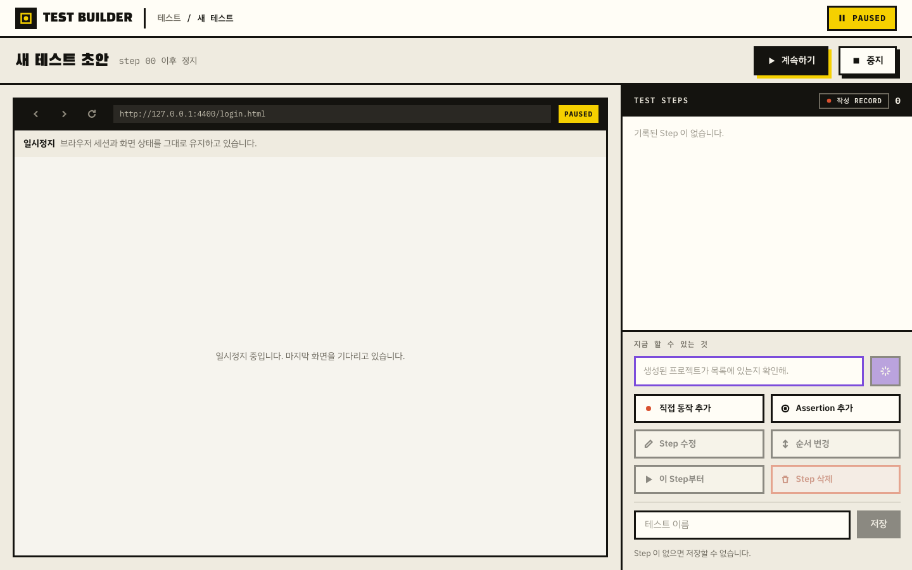
- **왜 문제인가**: 제품이 홍보하는 두 갈래 중 한 갈래가 화면에서 도달 불가능하다. 게다가
  실패했다는 말도 없이 다른 모드로 갈아타 버려서, 사용자는 자기가 뭘 잘못 눌렀는지 되짚게 된다.
- **개선 방향**: 세션이 `authoring_mode: "ai"` 이면 상태가 `paused` 여도 AI 화면
  (지시문 + 「AI 수행 → 기록된 STEP」)을 유지하고, 지시문을 화면에 남긴다. AI 호출이 시작되지
  않았다면 그 사실과 이유를 그 자리에 쓴다.
- **손대는 범위**: AI 화면 상태 분기(중) · **제약 확인**: 원칙 II(재실행에 LLM 불가)와
  무관 — 작성 국면이다. **의도 확인 필요**: 자격 증명 없이 `available: true` 를 돌려주는 것이
  의도인지.
- **미검증 고지**: 이 환경에는 `ANTHROPIC_API_KEY` 도 `ant` 도 없다. 위 결함 때문에 AI 호출
  자체가 시작되지 않았으므로, **AI 가 실제로 동작했을 때의 UX 는 검증하지 못했다.**

---

### U-08. 도구가 스스로 만들고 목록에 띄운 프로젝트를 도구가 열지 못한다 — 영향도: 상 | 화면: 프로젝트 | 시나리오: S2·S10

- **하려던 것**: 방금 만든 프로젝트를 「열기」로 다시 연다.
- **기대**: 열린다.
- **실제**: 「확인이 필요합니다 / **사용자 홈 디렉터리 아래의 경로만 열 수 있습니다.** /
  프로젝트 폴더 안의 경로를 지정하세요.」 (HTTP 400 `INVALID_PATH`). 그 프로젝트의 위치는
  **도구가 정하고 도구가 만들고 도구가 화면에 찍어 준 경로**다. 사용자는 아무 경로도 입력한
  적이 없는데 "경로를 지정하세요" 라는 지시를 받는다. 목록의 그 줄은 계속 남아 있고, 누를
  때마다 같은 실패를 반복하며, 지울 방법도 없다.
- **조건**: `XDG_DATA_HOME` 이 홈 디렉터리 밖을 가리킬 때 발생한다. 기본값
  (`~/.local/share`)에서는 재현되지 않는다. `XDG_DATA_HOME` 은 표준 환경 변수이고 이 워크스루
  절차 자체가 그것을 쓰도록 되어 있다.
- **증거**: 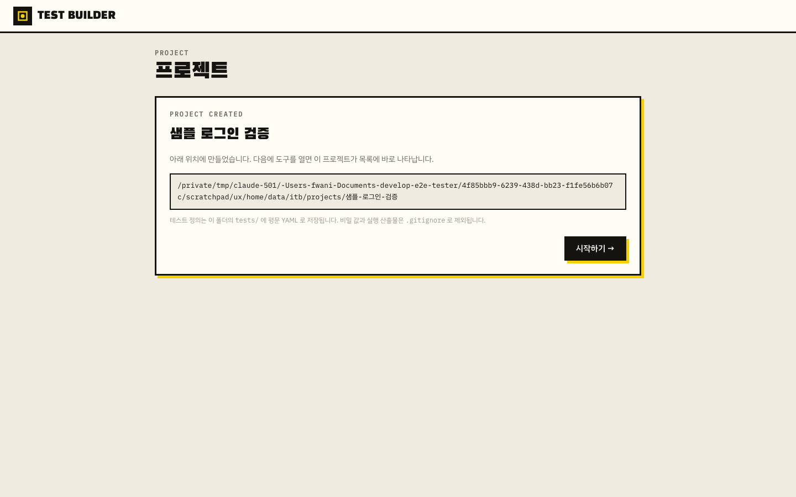 → 「열기」 →
  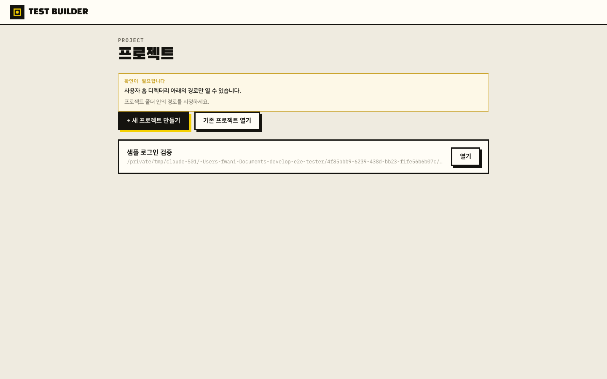
- **왜 문제인가**: 만들기는 되는데 열기는 안 되는 비대칭이다. 사용자는 자기가 뭘 잘못했는지
  알 수 없고 되돌릴 수도 없다.
- **개선 방향**: 열기 경로 검증 기준을 "홈 아래" 가 아니라 **"도구의 데이터 루트(레지스트리에
  등록된 위치) 아래 또는 사용자가 직접 고른 폴더"** 로 바꾼다. 최소 조치로도, 레지스트리에
  이미 있는 프로젝트는 검증을 통과시켜야 한다. 그리고 열 수 없는 줄은 목록에서
  「이 위치는 더 이상 열 수 없습니다 · [목록에서 지우기]」로 표시한다.
- **손대는 범위**: 경로 검증 규칙 + 목록 행 상태(소~중) · **제약 확인**: FR-088a(로컬 전용)
  와 무관. **의도 확인 필요**: 홈 밖 경로 차단이 보안 의도라면, 그렇다면 생성도 같은 규칙으로
  막아야 한다.

---

### U-09. 키가 `XDG_CONFIG_HOME` 을 따르지 않고, 교체 경고가 영향 범위를 축소해 말한다 — 영향도: 상 | 화면: 키 관리 | 시나리오: S9

- **하려던 것**: 격리된 환경에서 비밀값을 다루고, 막힌 키 상태를 푼다.
- **기대**: 격리된 `XDG_CONFIG_HOME` 아래에 이 인스턴스 전용 키가 만들어진다.
- **실제**: 격리 디렉터리에는 `registry.json` 만 생겼고, 제품은 **사용자의 실제
  `~/.config/itb/keys`** 를 읽어 내 테스트의 비밀값을 봉인했다. 「키 관리」 화면은
  「키는 프로젝트 밖(`~/.config/itb/keys`)에 있습니다」라고 고정 문구로 안내한다.
  그리고 「키 교체·삭제」의 경고는 **「… 이 프로젝트의 암호문도 함께 비웁니다」** 라고
  **이 프로젝트만** 언급한다. 실제로는 키가 장비 전역 1개이므로, 교체하면 **다른 모든
  프로젝트의 `secrets.local.yaml` 도 영구히 못 읽는 상태가 되는데** 그 프로젝트들은
  아무 통보 없이 남는다.
- **증거**: 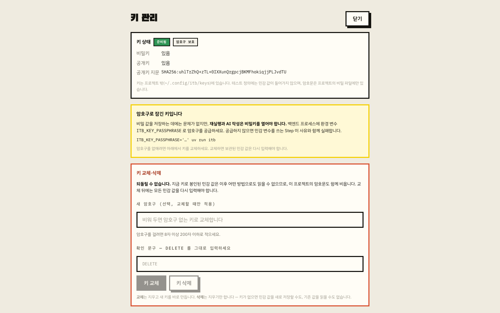
  관련 코드 `backend/src/itb/secrets/keys.py:26`
  (`DEFAULT_KEY_DIR = pathlib.Path.home() / ".config" / "itb" / "keys"` — 환경 변수 미반영.
  같은 저장소의 `backend/src/itb/storage/paths.py:34` 는 환경 변수를 반영한다.)
- **왜 문제인가**: 되돌릴 수 없는 조작인데 경고가 실제 영향 범위보다 좁게 말한다. 또한 격리
  실행(테스트·CI·다중 체크아웃)에서 한 인스턴스의 「키 교체」가 사용자의 실제 비밀값 전부를
  날린다.
- **개선 방향**: (1) 키 경로도 `XDG_CONFIG_HOME` 을 따르게 하고, 화면에는 **실제 경로**를 찍는다.
  (2) 교체 경고를 「이 장비의 모든 ITB 프로젝트에서 지금 키로 봉인된 값이 모두 못 읽게 됩니다.
  영향받는 프로젝트: N개」로 바꾸고 목록을 보여준다.
- **손대는 범위**: 키 경로 해석 + 경고 문구·영향 집계(중) · **제약 확인**: FR-089c 계열.
  **의도 확인 필요** — 키를 장비 전역 1개로 두는 것이 설계 의도인지.
- **수행 고지**: 위험을 알고 있어 **「키 교체」·「키 삭제」는 누르지 않았다.** 두 버튼의 실제
  동작은 미검증이다.

---

## 중

### U-10. 「저장」으로 가는 유일한 길의 이름이 「중지」다 — 영향도: 중 | 화면: 녹화 | 시나리오: S3

녹화 중 화면의 버튼은 「일시정지」와 「중지」뿐이다. 녹화를 끝내고 저장하려면 「중지」를 눌러야
리뷰 화면이 나오는데, 「중지」는 "그만두다·버리다" 로 읽힌다. 실제로 눌렀을 때 나온 문구도
「브라우저 세션이 **유실**됐습니다」였다(U-11). 개선: 「녹화 마치기」 또는 「기록 끝내고 검토」로
바꾸고, 「중지」는 버리기 동작에만 쓴다. 손대는 범위: 문구(소).

### U-11. 의도적으로 중지했는데 "유실됐습니다" 경고 2개가 겹쳐 뜨고 세션 UUID 가 노출된다 — 영향도: 중 | 화면: 리뷰 | 시나리오: S3

「중지」 한 번에 화면 위쪽 44% 가 경고로 덮인다.
① 노란 「확인이 필요합니다 / 세션을 찾을 수 없습니다: `f64d0c3a3f5c4d328b9c8064feed82bf` /
세션이 이미 끝났습니다. 새 세션을 시작하세요.」 — 사용자가 하지 않은 요청에 대한 오류이며
**내부 세션 UUID 를 그대로 노출**한다.
② 빨간 「브라우저 세션이 유실됐습니다 / 열려 있던 탭이 모두 닫혀 세션이 유실됐습니다」 —
사용자가 스스로 끝낸 것을 사고처럼 말한다. 같은 문장이 이 화면에 3번 반복된다.
③ 미러의 「SESSION ENDED / 세션을 종료했습니다.」 — 이것만 사실이다.
게다가 이 경고들이 Step 목록과 「저장」을 화면 밖으로 밀어낸다.
증거: 
개선: 사용자가 스스로 종료한 경우와 예기치 않게 끊긴 경우를 구분해 전자는 조용한 확인 문구
하나로 끝낸다. 종료 직후의 세션 폴링은 오류로 올리지 않는다. 어떤 경우에도 UUID 는 노출하지
않는다. 손대는 범위: 종료 흐름 상태 처리(소~중).

### U-12. 「지금 할 수 있는 것」 패널이 Step 목록을 가린다 — 영향도: 중 | 화면: 일시정지·리뷰 | 시나리오: S5·S3

Step 목록 아래에 떠 있는 액션 패널이 목록 마지막 항목 위로 겹쳐 그려진다. 리뷰 화면에서는
Step 03 이 반쯤 잘려 있고, 일시정지 화면에서는 Step 05 가 잘린다. 목록을 더 스크롤해도
패널 뒤로 들어간다. 증거: 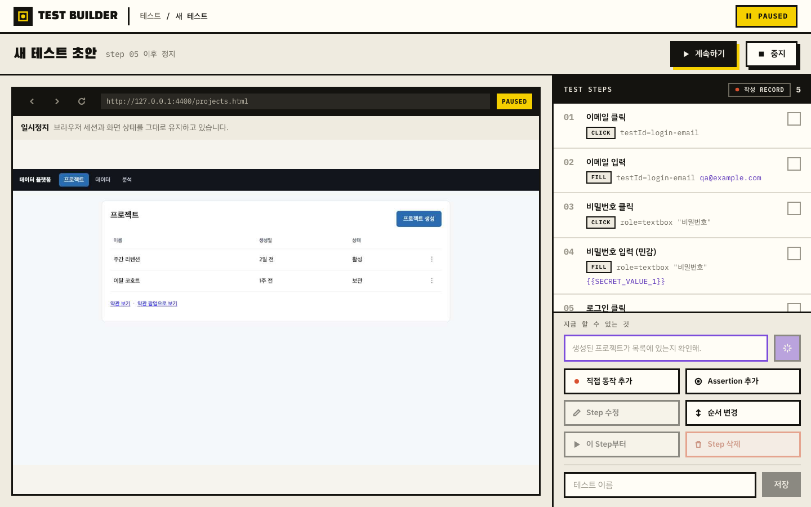
개선: 패널을 목록과 같은 흐름에 두거나(스크롤 영역에서 제외) 목록 하단에 패널 높이만큼
여백을 준다. 손대는 범위: 레이아웃(소).

### U-13. 비활성 버튼이 왜 비활성인지 어디에도 없고, 활성 버튼과 생김새가 같다 — 영향도: 중 | 화면: 전역 | 시나리오: S2·S3·S5·S6

반복해서 부딪혔다.
- 새 프로젝트 대화상자: 이름을 채워도 「만들기」가 계속 비활성. **필수 표시(\*)가 없어
  「기본 시작 URL」이 필수라는 걸 알 수 없다.** 증거: 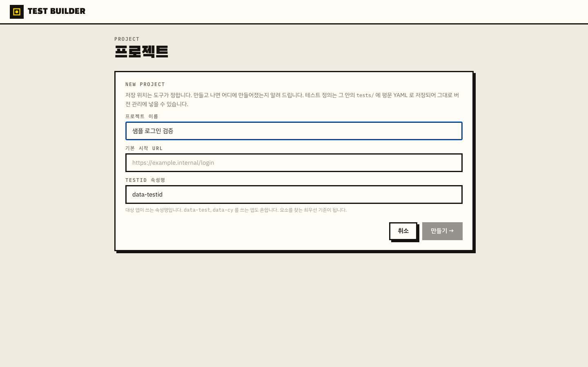
- 일시정지 화면: 「Step 수정」·「Step 삭제」·「이 Step부터」가 비활성. Step 을 하나 고르면
  풀린다는 안내가 없다.
- 리뷰 화면: 「저장」 비활성 — 이름이 필요하다는 말이 없다.
- AI 화면: 「AI 실행 →」과 「테스트로 저장」이 **똑같은 회색 블록**인데 앞의 것은 눌리고 뒤의
  것은 안 눌린다. 증거: 

개선: (1) 필수 항목 표시. (2) 비활성 버튼 바로 아래에 이유 한 줄(「Step 을 하나 고르세요」,
「테스트 이름을 입력하세요」) — 리뷰 화면의 「Step 이 없으면 저장할 수 없습니다」는 좋은
선례이므로 전 화면에 적용한다. (3) 비활성 스타일을 활성과 확실히 구분한다.
손대는 범위: 폼·버튼 공통(중).

### U-14. 프로젝트를 한 번 열면 다른 프로젝트로 갈 길이 없다 — 영향도: 중 | 화면: 전역 헤더 | 시나리오: S2

헤더의 `프로젝트 | 샘플 로그인 검증` 은 링크처럼 보이지만 클릭해도 아무 일이 없고, Tab 순회에도
잡히지 않는다(순회 대상: 비밀 값 · 키 관리 · 테스트 만들기 · 검색 · 실행 · 행 메뉴).
프로젝트를 닫거나 바꾸려면 백엔드를 재시작하는 수밖에 없다.
개선: 헤더의 프로젝트 칩을 눌러 「프로젝트 바꾸기 / 프로젝트 닫기」 메뉴를 연다.
손대는 범위: 헤더(소).

### U-15. 실패한 Step 번호가 화면마다 다르다 (step 03 vs STEP 04) — 영향도: 중 | 화면: 목록·결과 | 시나리오: S4

목록 행의 실패 요약은 「**step 03** · 민감 변수 …」, 같은 실패를 결과 화면은 「**STEP 04** 실패」,
Step 목록도 `04` 로 표시한다. 0-기반 인덱스(`failed_step_index: 3`)가 한쪽에만 그대로 새어
나왔다. 사용자를 엉뚱한 Step 으로 보낸다.
증거: 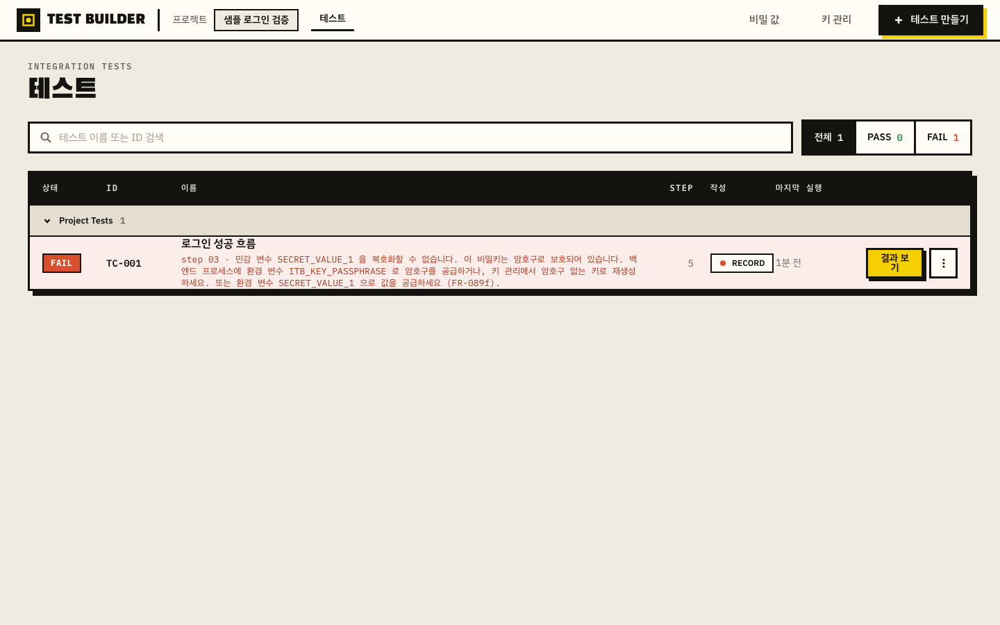
개선: 표시용 번호를 한 곳에서 만들어 쓴다(1-기반). 손대는 범위: 소.

### U-16. 사용자가 브라우저 창을 닫으면 그 행위가 Step 으로 기록된다 — 영향도: 중 | 화면: 리뷰 | 시나리오: S10

녹화 중 브라우저 창을 닫자 Step 이 3개가 아니라 4개가 되었다 — `04 탭 0 닫기 / CLOSE_TAB`.
화면은 「기록된 Step 은 보존했습니다」라고만 하고 마지막 Step 이 사고의 부산물이라는 사실을
알리지 않는다. 이대로 저장하면 재실행 때 탭을 닫는 테스트가 된다.
증거: 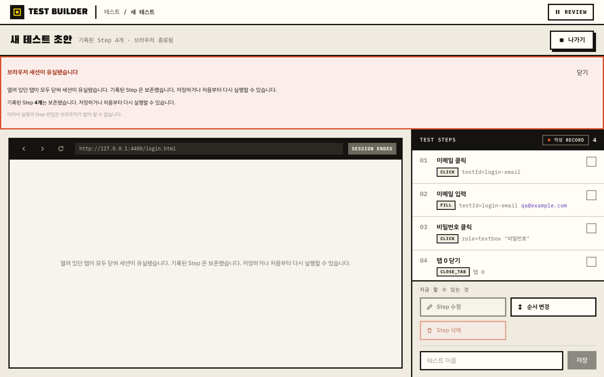
개선: 세션 유실을 유발한 마지막 CLOSE_TAB 은 기록하지 않거나, 기록하되 「이 Step 은 창을
닫아서 생겼습니다 · [지우기]」로 표시하고 기본 선택 상태로 둔다. 손대는 범위: 소~중.

### U-17. 「계속하기」 후 요약이 「PASS · 0 / 5 통과 · 0.00 s」 — 영향도: 중 | 화면: 실행 | 시나리오: S5

일시정지 → Step 삭제 → 계속하기 를 하면 (앞 Step 을 다시 돌리지 않는 것은 옳다) 상태가
`완료` 로 바뀌면서 요약줄이 `PASS · 0 / 5 통과 · 0.00 s` 가 된다. 통과 0개인데 PASS 라고
쓰여 있고 소요 시간은 0.00초다.
개선: 이어서 실행한 구간만 세거나(`이어서 실행 · Step 06 이후 통과`), 재개 세션에서는
통과/전체 요약을 아예 감춘다. 손대는 범위: 소.

### U-18. 「계속하기」로 돌아가면 저장 버튼이 사라진다 — 영향도: 중 | 화면: 실행 | 시나리오: S5

일시정지 화면에는 「저장」이 있는데, 계속하기를 눌러 재개하면 화면이 실행 모드로 바뀌면서
「저장」이 없어지고 「Step 추가」(비활성)만 남는다. 저장하려면 다시 「중지」를 눌러야 한다(U-10).
개선: 작성 중 세션에서는 상태와 무관하게 저장 경로를 유지한다. 손대는 범위: 소.

### U-19. Step 삭제에 확인도 되돌리기도 없다 — 영향도: 중 | 화면: 일시정지·리뷰 | 시나리오: S5

「Step 삭제」를 누르면 즉시 지워지고 되돌릴 방법이 없다. 삭제 직후 「Step 수정」·「Step 삭제」가
계속 활성으로 남아 있어(선택이 사라졌는데) 연달아 잘못 누르기 쉽다.
증거: 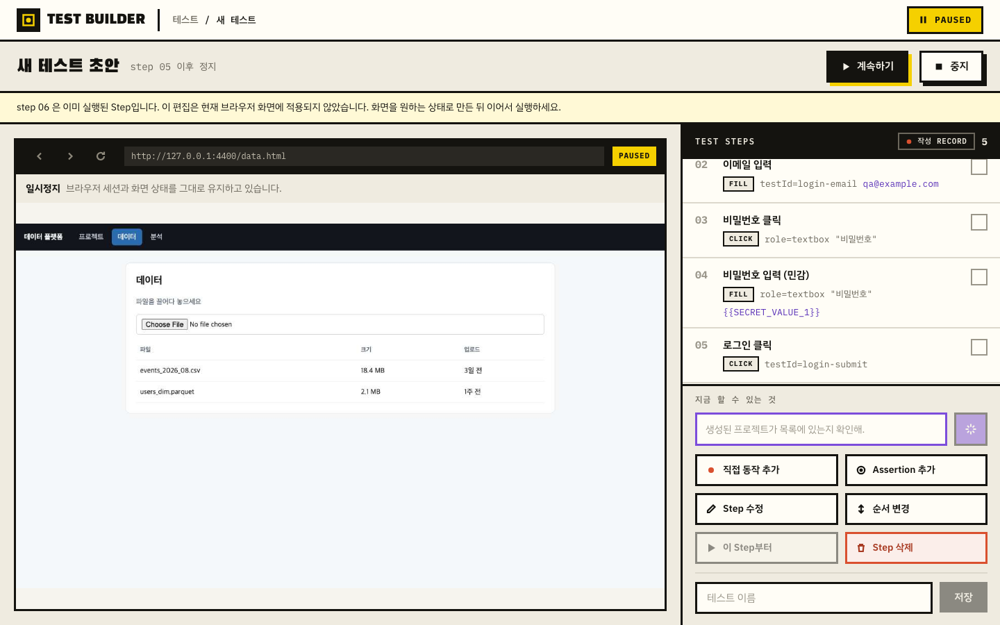
개선: 삭제 후 「Step 06 을 지웠습니다 · [되돌리기]」 스낵바(5초). 삭제 후 선택 해제 상태를
버튼에 반영한다. 손대는 범위: 소.

### U-20. Step 행을 키보드로 고를 수 없다 (접근성) — 영향도: 중 | 화면: Step 목록 | 시나리오: S5

Step 행은 `
` 로, `role`·`tabindex`·`aria-*` 가 하나도 없다.
Step 선택은 「Step 수정 / 삭제 / 이 Step부터」의 전제 조건이므로, 키보드만 쓰는 사용자는
편집 기능 전체에 도달할 수 없다. 화면 오른쪽의 체크박스 모양도 실제 `<input>` 이 아니다.
개선: 행을 `role="option"` + `tabindex` 로 만들고 목록을 `role="listbox"` 로 감싼다.
Space/Enter 로 선택, 화살표로 이동. 손대는 범위: 소~중.

### U-21. 테스트 이름을 눌러도 아무 일이 없다 — 영향도: 중 | 화면: 테스트 목록 | 시나리오: S4

목록에서 「로그인 성공 흐름」을 클릭해도 반응이 없다. 정의를 보려면 행 오른쪽 점 3개 메뉴를
열어 「정의 보기」를 골라야 한다. 그 메뉴는 `aria-label` 이 잘 붙어 있어(「로그인 성공 흐름 추가
동작」) 접근성은 좋지만, 가장 큰 클릭 표적인 이름이 죽어 있다.
증거: 
개선: 이름 클릭 = 정의 보기. 손대는 범위: 소.

### U-22. 대화상자가 뒤 화면을 통째로 지운다 — 영향도: 중 | 화면: 테스트 만들기·비밀 값·키 관리 | 시나리오: S3·S9

「테스트 만들기」를 열면 헤더와 목록이 모두 사라지고 빈 배경 위 왼쪽 위에 패널만 남는다.
반투명 오버레이도, 뒤 화면도 없어 어디에 있다가 왔는지 감각이 끊긴다. 「비밀 값」·「키 관리」도
같다. 증거: 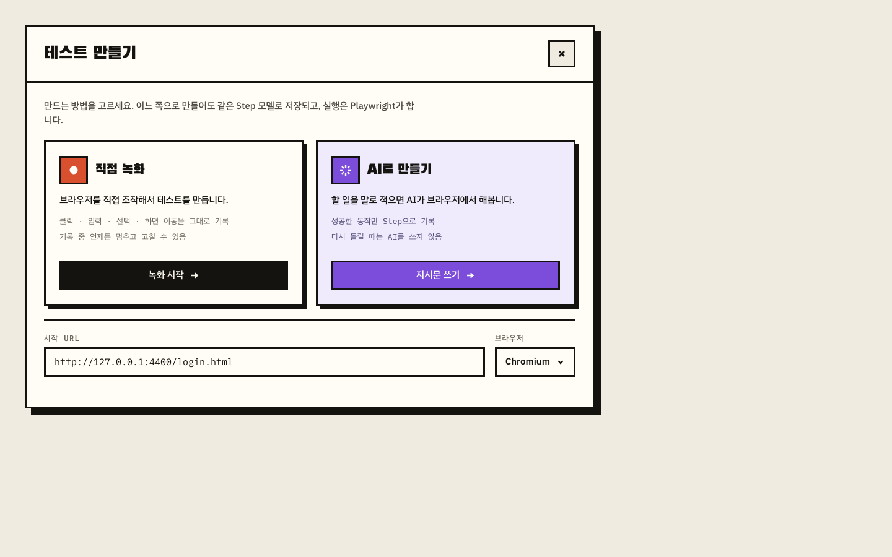
개선: 뒤 화면을 유지한 채 반투명 오버레이 + 중앙 정렬 모달로 바꾼다. 손대는 범위: 소~중.

### U-23. 「테스트 만들기」에서 시작 URL 이 실행 버튼보다 아래에 있다 — 영향도: 중 | 화면: 테스트 만들기 | 시나리오: S3

두 개의 큰 카드(「녹화 시작」/「지시문 쓰기」) 아래, 구분선 너머에 「시작 URL」과 「브라우저」가
있다. 눈은 카드에서 멈추므로 URL 을 확인하지 않고 시작하기 쉽다. 시작 URL 이 무엇인지가
그 두 버튼의 결과를 결정하는데도 그렇다.
개선: 시작 URL·브라우저를 카드 위로 올리거나, 카드 안 버튼 위에 현재 시작 URL 을
「http://127.0.0.1:4400/login.html 에서 시작합니다」로 명시한다. 손대는 범위: 소.

---

## 하

- **U-24. 사용자 문구에 내부 요구사항 ID 가 노출된다.** 「… 값을 공급하세요 **(FR-089f)**」,
  「… Step 상세에서 하세요 **(FR-020)**」. 사용자에게는 의미 없는 기호다. 문구에서 제거하고
  필요하면 개발자용 로그에만 남긴다.
- **U-25. 실패 원인 전문이 목록 행에 그대로 들어가 레이아웃을 깨뜨린다.** 3줄짜리 원시
  메시지가 행 높이를 늘려 「결과 보기」 버튼이 「결과 보 / 기」로 줄바꿈된다. 한 줄 요약
  (「민감 변수 SECRET_VALUE_1 을 복호화할 수 없습니다」)만 두고 나머지는 결과 화면으로.
  증거: 
- **U-26. 실패 메시지가 개발자용이다.** 「백엔드 프로세스에 환경 변수 ITB_KEY_PASSPHRASE 로
  암호구를 공급하거나…」 — 단독 로컬 도구 사용자에게 프로세스·환경 변수는 낯설다. 화면 안에서
  암호구를 한 번 입력받는 길(세션 한정, 저장 안 함)이 있으면 이 메시지 전체가 필요 없어진다.
- **U-27. 생성된 프로젝트 경로에 복사 버튼이 없다.** 「PROJECT CREATED」 화면의 경로는 선택은
  되지만 「복사」·「폴더 열기」가 없다. 증거: 
- **U-28. 행 메뉴 항목 「이름」이 동사가 없다.** 「정의 보기」·「삭제」와 나란한데 혼자 명사다.
  「이름 바꾸기」로.
- **U-29. 첫 화면·목록 화면이 화면 상단 25% 만 쓰고 나머지가 빈다.** 1440×900 에서 아래
  60% 이상이 비어 있다. 증거: 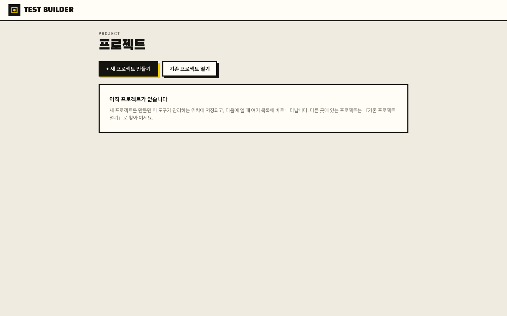
- **U-30. 실행 화면의 포커스 링이 브라우저 기본값이다.** 굵은 검은 테두리 디자인 위에 얇은
  파란 실선(`outline: auto 1px rgb(0,95,204)`)이 얹혀 이질적이다. 디자인 토큰으로 통일.
- **U-31. `/api/health` 의 `bind` 가 실제 바인딩 포트와 다르다.** 4420 에서 뜬 서버가
  `"bind":"127.0.0.1:4320"` 을 돌려준다. 화면에 노출되지는 않지만 진단할 때 사람을 속인다.
- **U-32. 프로젝트가 없을 때 `/api/project` 404 가 콘솔 오류로 두 번 찍힌다.** 정상 상태를
  오류로 기록한다. 화면에는 영향 없다.
- **U-33. 「기존 프로젝트 열기」와 목록 행의 「열기」가 같은 접근성 이름 공간을 쓴다.** 자동화·
  스크린리더에서 구분이 모호하다.

---

## 잘 된 점

개선 과정에서 잃지 말아야 할 것들이다.

1. **빈 상태가 다음 한 걸음을 말해 준다.** 첫 화면의 「아직 프로젝트가 없습니다 / 새 프로젝트를
   만들면 이 도구가 관리하는 위치에 저장되고…」, 테스트 목록의 「「테스트 만들기」로 첫 테스트를
   만드세요」. 3초 안에 다음 행동을 안다.
2. **저장 위치를 만든 직후 실제 절대 경로로 알려 준다.** 「아래 위치에 만들었습니다」 +
   경로 + 「테스트 정의는 이 폴더의 tests/ 에 평문 YAML 로 저장됩니다」.
3. **비밀값 처리가 견고하다.** 비밀번호 입력이 자동으로 `비밀번호 입력 (민감)` 으로 분류되고
   화면·YAML 어디에도 평문이 없다(`value: '{{SECRET_VALUE_1}}'`). `secrets.local.yaml` 은
   0600, `.gitignore` 는 **왜 제외하는지 이유까지** 적어 자동 생성된다.
   「값은 어떤 화면에도 표시되지 않습니다. 서버에 값을 돌려주는 경로가 없습니다.」는 모범 문구다.
4. **미러의 읽기 전용 안내가 명확하다.** `READ ONLY` 배지 + 「실제 브라우저 창에서 조작 중 /
   이 영역은 관찰용이며 조작 대상이 아닙니다」가 배지·오버레이·본문 3중으로 일관되게 나온다.
5. **일시정지 → 편집 → 계속하기가 설계대로 동작한다.** 「브라우저 세션과 화면 상태를 그대로
   유지하고 있습니다」, 이미 실행된 Step 을 지우면 「step 06 은 이미 실행된 Step입니다.
   이 편집은 현재 브라우저 화면에 적용되지 않았습니다. 화면을 원하는 상태로 만든 뒤 이어서
   실행하세요.」 — 사용자가 잘못 기대할 지점을 정확히 짚는다. 계속하기 후 로그인이 다시
   돌지 않는 것도 확인했다.
6. **Locator 후보를 전부 보여 준다.** 결과 화면의 「시도한 LOCATOR (우선순위 순)」와 정의 화면의
   6행 후보 표(`test id / role + 이름 / label / 보이는 텍스트 / 고정 속성 / CSS 경로`,
   「사용 중」·「대체 1」·「최후」 표시)는 "왜 이 요소로 잡혔는가" 에 정면으로 답한다.
7. **위험한 조작의 확인 절차가 제대로 있다.** 키 교체·삭제는 빨간 영역 + 「되돌릴 수 없습니다」
   + `DELETE` 확인 문구 + 두 동작의 차이 설명까지 갖췄다.
   증거: 
8. **시작 URL 형식 검증이 즉시·인라인으로 뜬다.** 「시작 URL 은 http:// 또는 https:// 로
   시작해야 합니다.」와 함께 두 시작 버튼이 동시에 잠긴다.
   증거: 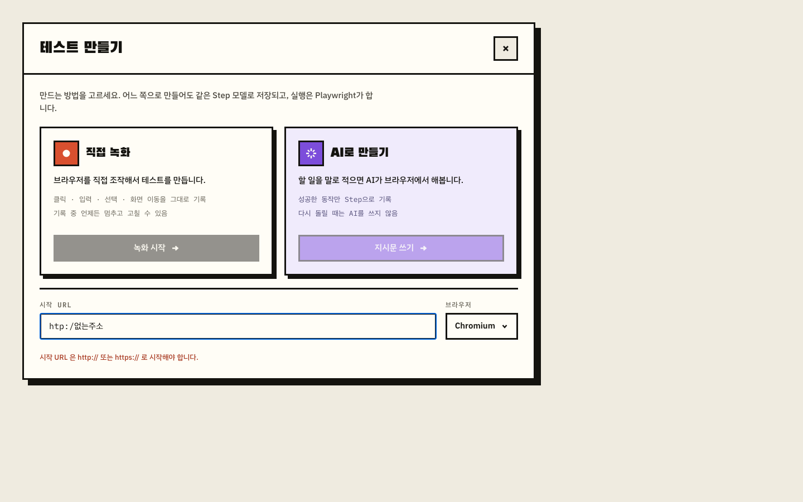
9. **AI 경로의 제약을 사용자 말로 설명한다.** 「지시문은 테스트로 저장되지 않습니다. AI가 실제로
   성공한 동작만 Step으로 저장되고, 다시 돌릴 때는 AI를 쓰지 않습니다.」 — 헌법 원칙 II 를
   내부 용어 없이 전달한다.
10. **결과 화면의 정보 구조가 좋다.** 총 시간 / 통과·전체 / 멈춘 Step 3분할 요약 → Step 결과 →
    실패 상세 → 다음 행동(실패한 Step부터 실행 · 처음부터 실행 · Step 고치기). 상태 표시가
    색뿐 아니라 ✓·✕ 글리프를 함께 쓴다. **U-02 는 이 화면이 나쁘다는 뜻이 아니라, 사용자가
    여기에 도달하지 못한다는 뜻이다.**

---

## 미검증 · 확인 필요

| 항목 | 상태 | 사유 |
|---|---|---|
| S6 AI 작성 성공 경로 | 미검증 | 「AI 실행」이 시작되지 않음(U-07). 더해 이 환경에는 `ANTHROPIC_API_KEY`·`ant` 자격 증명이 없어 실제 모델 호출 UX 를 볼 수 없었다. 지시대로 키를 새로 만들거나 파일에 쓰지 않았다. |
| S7 사람 인수 후 Step 기록 | 판단 보류 | 「직접 동작 추가」는 `record-actions:start` 를 정상 호출하고 화면도 인수 모드로 바뀌었으나, 실제 브라우저에서 한 클릭·입력이 서버 기준으로도 0건 기록됐다. 동일 조작이 순수 녹화 세션에서는 정상 기록됐다. 재현 조건을 더 좁히지 못했다. |
| S7 인수 화면 배지 「AI 수행 완료」 | 결함으로 봄, 확인 필요 | AI 가 한 번도 수행되지 않았는데 헤더에 「AI 수행 완료」가 뜬다. 상태 라벨 매핑 문제로 보이나 AI 가 정상 동작할 때의 표시를 못 봐서 단정하지 않는다. |
| 「키 교체」·「키 삭제」 실동작 | 미검증(의도적) | 제품이 사용자의 실제 `~/.config/itb/keys` 를 쓰고 있어(U-09) 실행하면 사용자 데이터를 파괴한다. 누르지 않았다. |
| U-08 홈 밖 경로 차단 | 의도 확인 필요 | 보안 의도라면 생성도 같은 규칙으로 막아야 앞뒤가 맞는다. |
| U-09 키를 장비 전역 1개로 두는 설계 | 의도 확인 필요 | 의도라면 「키 교체」 경고의 영향 범위 문구를 고쳐야 한다. |
| `available: true` 인데 자격 증명이 없는 경우 | 의도 확인 필요 | `/api/ai/availability` 가 무엇을 근거로 판단하는지 화면에서 알 수 없다. |
| 마우스 없는 전체 조작 | 부분 검증 | 목록·헤더의 Tab 순회와 포커스 표시는 확인했다. Step 목록은 키보드 도달 불가(U-20). 실행·일시정지 화면 전체 키보드 조작은 시간상 훑지 못했다. |
| 다중 탭 · 탭 전환 시나리오 | 미검증 | `/api/sessions/{id}/tabs`·`mirror-tab` 관련 화면을 걸지 않았다. |
| Assertion 4종 추가 | 미검증 | 「Assertion 추가」 버튼 존재만 확인. 시간상 4종 각각을 걷지 못했다. |
