# UX 워크스루 — 2026-09-07

신고 범위(결과 보기 페이지 · 실행 제어 4종)에 집중한 세션이다. 격리된 XDG 환경에
전용 포트(대상 앱 4400 · API 4420 · UI 4410)로 띄우고, 사용자의 4310·4320 서버는
건드리지 않았다. 녹화 국면만 CDP 하니스를 썼고, 실행 제어 검증은 모두 제품 프론트를
직접 조작했다.

## 요약

- 걸은 시나리오 **9건**, 발견 **21건** (상 8 / 중 11 / 하 2), 미검증 **3건**.
- **가장 아픈 것**: 실패한 실행의 결과 화면에서 「실패한 Step부터 실행」·「처음부터 실행」이
  **항상 409 로 거부된다**. 화면은 "먼저 중지하세요"라고 하지만 그 화면에 중지가 없다.
  재실행 경로가 정상 경로에서 막혀 있다 (U-01).
- **중지**는 누르면 곧바로 걸리지만, 결과 화면이 "브라우저 세션이 유실됐습니다"라는
  **오류**와 「TC-002 초안」 저장 화면으로 바뀌고, 사용자가 스스로 멈춘 실행이 **FAIL** 로
  기록된다. 중단과 실패가 구분되지 않는다 (U-03).
- **일시정지**는 누른 지 0.1초에 화면이 이미 "PAUSED · 브라우저 세션과 화면 상태를 그대로
  유지하고 있습니다"라고 말하지만 **실제 실행은 계속된다.** 실측 19초 뒤 실행이 끝났고,
  화면은 그때도 PAUSED 배지와 FAIL 요약을 동시에 보여줬다 (U-04).
- **일시정지 후 「계속하기」** 를 누르면 실패한 Step 을 건너뛰고 다음 Step 만 실행해
  **「완료」** 로 표시한다. 저장된 결과는 FAIL 인데 화면은 완료라고 말한다 (U-05).
- **「처음부터 실행」에 연타 방어가 없어** 같은 테스트에 세션(실제 브라우저 창)이 두 개
  만들어졌고, 목록에 구분 불가능한 배너가 두 줄로 떴다 (U-06).
- 목록의 실패 요약 Step 번호가 **1 작다** — 실제 실패는 step 06 인데 "step 05"로 쓴다.
  「실패한 Step부터 실행」의 시작점 예측을 정면으로 방해한다 (U-07).
- 결과 보기 페이지 **자체의 구성은 좋다** — 요약 3칸, Step별 결과, 실패 사유 + 다음 행동,
  Locator 후보, 증거 탭. 문제는 그 페이지에서 나가는 버튼들이다.

## 걸은 범위

| 시나리오 | 수행 | 조작 방법 | 비고 |
|---|---|---|---|
| S1 첫 실행 · 프로젝트 생성 | O | 프론트 직접 | 격리 경로 확인 |
| S2 직접 녹화 → 저장 | O | CDP 하니스 | 하니스 영향 가능성 있음(U-03 참조) |
| S3 실패 테스트 실행 · 결과 보기 | O | 프론트 직접 | TC-002 를 실패 재료로 준비 |
| S4 「실패한 Step부터 실행」 | O | 프론트 직접 | 결과 페이지·러너 두 경로 모두 |
| S5 「처음부터 실행」 | O | 프론트 직접 | 연타 포함 |
| S6 「중지」 (실행 중 / 완료 후) | O | 프론트 직접 | 연타 포함 |
| S7 「일시정지」 → 「계속하기」 | O | 프론트 직접 | 20초 대기 Step 중에 조작 |
| S8 성공 실행의 결과 표시 | O | 프론트 직접 | TC-003 |
| S9 실행 중 새로고침 · 결과 화면 새로고침 | O | 프론트 직접 | |
| 저장 연타 / 저장 실패 표시 | 부분 | 프론트 직접 | 저장 실패는 미검증 |
| AI 작성 · 사람 인수 | X | — | 언어모델 자격 증명 없음 |

### 검증 재료

`fixtures/sample-app` 위에 세 개의 테스트를 두었다. TC-001 은 제품으로 직접 녹화해
저장했고(로그인 → 프로젝트 생성, 6 Step), TC-002·TC-003 은 TC-001 의 저장물을 복제해
**중간 Step 이 반드시 깨지는 형태**로 만들었다 (`tests/*.yaml` 편집. 제품 코드 무수정).

- **TC-002** (7 Step): step 01~05 로그인 성공 → **step 06 이 존재하지 않는
  `testId=dashboard-open` 을 20초 대기 후 실패** → step 07 미실행. 「실패한 Step부터
  실행」과 중지·일시정지 반응 지연을 재는 창(20초)을 여기서 얻었다.
- **TC-003** (5 Step): 로그인만. 항상 PASS. 완료 후 표시 비교용.

---

## 발견

### U-01. 결과 화면의 재실행 버튼 두 개가 방금 끝난 실행 직후에는 항상 거부된다 — 영향도: 상 | 화면: RunResult | 시나리오: S4·S5

- **하려던 것**: 실패를 확인한 결과 화면에서 바로 「실패한 Step부터 실행」을 누른다.
- **기대**: 실패한 Step 부터 다시 돌기 시작한다.
- **실제**: 화면 맨 위에 노란 경고가 뜬다 — "**TC-002 에 이미 실행 중인 세션이 있습니다.
  먼저 중지하세요.** / 진행 중인 세션을 끝내거나 그 세션으로 이동하세요." 아무것도 실행되지
  않는다. **그런데 이 화면에는 중지 버튼도, 그 세션으로 가는 링크도 없다.**
  「처음부터 실행」도 같다.
- **증거**: 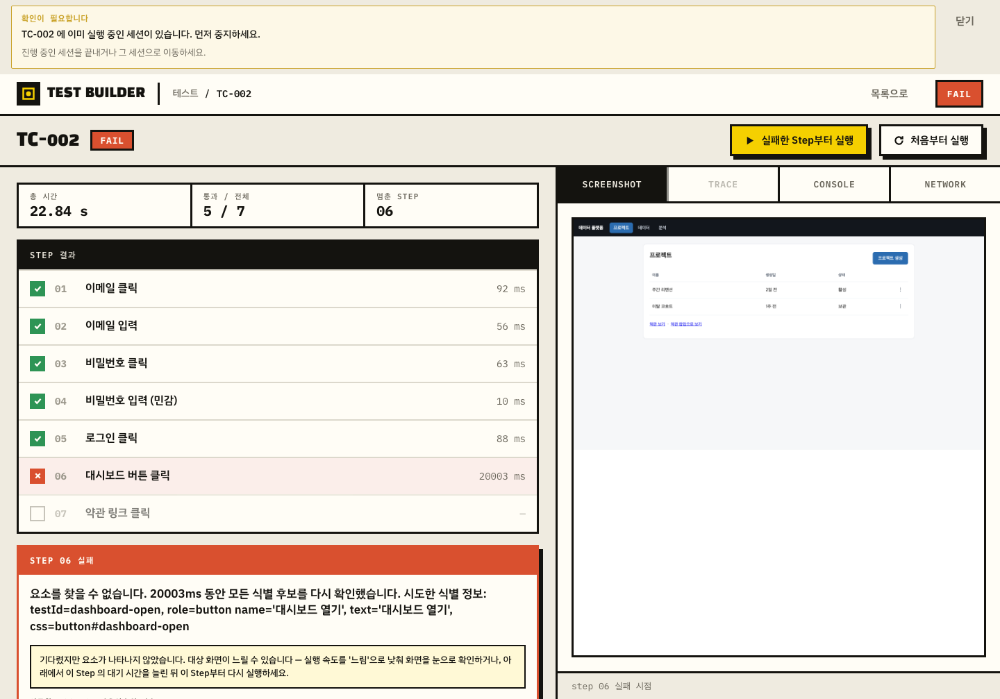
  네 번 눌러 `POST /api/sessions` 4건 모두 409.
- **왜 그렇게 보이는가**: 실행이 끝나도 세션은 `failed` 상태로 등록에 남는다.
  `backend/src/itb/execution/session.py:376` 의 `active_session_for_test` 는 상태를 보지
  않고 `_by_test` 를 그대로 돌려주므로 **종료된 세션도 "실행 중"으로 센다**.
  그리고 러너 화면의 같은 버튼은 `frontend/src/pages/SessionScreen.tsx:437` 의 `rerun` 이
  **먼저 `discard` 하고 나서** 새 세션을 만드는데, 결과 화면의 버튼은
  `frontend/src/pages/RunResult.tsx:164`·`:186` → `frontend/src/App.tsx:65` 의
  `startReplay` 를 바로 부른다. 같은 이름의 버튼이 두 화면에서 다르게 동작한다.
- **왜 문제인가**: 실패 진단 → 재실행이라는 가장 흔한 한 바퀴가 정상 경로에서 끊긴다.
  사용자는 목록으로 돌아가 배너의 「중지하고 버리기」(파괴적으로 읽히는 이름)를 눌러야
  한다는 것을 **혼자 알아내야 한다.** 그마저도 목록에는 그 테스트의 「실행」 버튼이
  없다(U-12).
- **개선 방향**:
  1. 결과 화면의 두 버튼도 러너와 같은 `rerun` 경로를 쓴다 — 종료된 세션이 있으면 조용히
     정리한 뒤 새 세션을 만든다.
  2. `active_session_for_test` 가 **종료 상태(completed/failed/review/stopped/lost)는
     제외**한다. 종료된 세션이 다음 실행을 막을 이유가 없다.
  3. 그래도 거절해야 하는 경우(정말 실행 중)의 문구를 바꾼다 — "TC-002 가 지금 실행
     중입니다. 「실행 중인 세션 보기」로 이동한 뒤 중지하세요." + 그 자리에 이동 버튼.
- **손대는 범위**: 소~중 (`RunResult.tsx`, `App.tsx`, `session.py`) · **제약 확인**:
  FR-043(테스트당 동시 실행 1건)은 유지된다. 종료 세션을 제외하는 것은 오히려 FR-043 의
  취지에 맞다 — `sessions.py` 의 `stop` 주석도 같은 이유를 이미 적어 두었다.

### U-02. 「실패한 Step부터 실행」이 앞 Step 을 건너뛴 사실을 어디에도 말하지 않고, 결과를 「0 / 7 통과」로 덮는다 — 영향도: 상 | 화면: Runner·RunResult | 시나리오: S4

- **하려던 것**: step 06 만 다시 시도해 고쳐졌는지 본다.
- **기대**: "step 06 부터 실행합니다. 01~05 는 건너뜁니다"를 알려 주고, 결과에 그 사실이
  남는다.
- **실제**:
  1. 실행 중 화면은 Step 01~07 **전부 빈 체크박스**다. 어디부터 도는지, 무엇을 건너뛰는지
     화면에 없다. 진행 표시만 `step 06 / 07` 로 시작한다.
     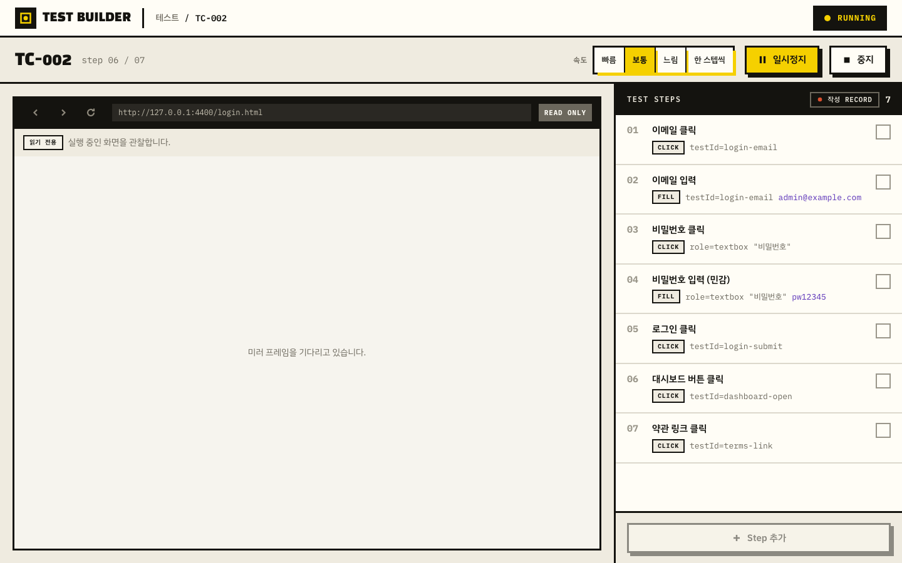
  2. 미러는 20초 내내 "미러 프레임을 기다리고 있습니다"만 띄웠다 — 화면 확인도 못 한다.
  3. 끝나면 **「통과 / 전체 = 0 / 7」**. 직전 실행의 5 / 7 이 사라진다. 부분 실행이라는
     표시는 없다. 건너뛴 01~05 와 도달 못한 07 이 **똑같이 "—" + 빈 체크박스**다.
     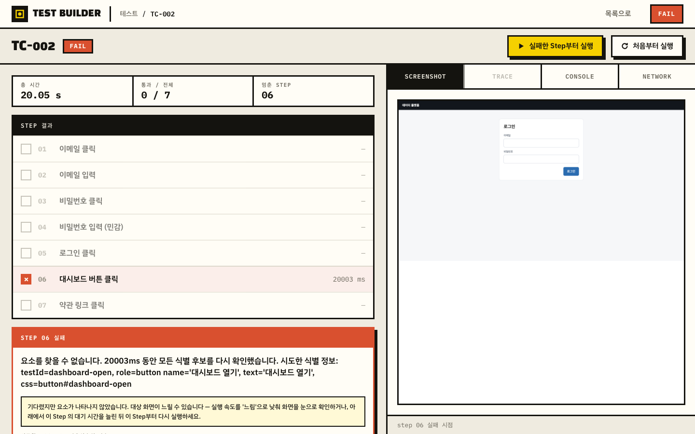
  4. 실패 사유는 첫 실행과 **문구가 완전히 같다.** 하지만 원인은 다르다 — 증거
     스크린샷은 **로그인 화면**이다. 로그인 Step 을 건너뛰었으니 대시보드 버튼이 있을
     수가 없다. 그런데 안내는 "대상 화면이 느릴 수 있습니다 — 실행 속도를 '느림'으로
     낮추거나 이 Step 의 대기 시간을 늘린 뒤 다시 실행하세요"라며 **틀린 방향**을 지시한다.
- **왜 문제인가**: 사용자가 신고한 "앞선 성공 Step 의 상태(로그인)가 없는데 재개가 되는가"가
  바로 이것이다. 재개는 되지만 **전제 상태 없이** 되고, 화면은 그것을 숨긴다. 사용자는
  대기 시간을 늘리며 몇 바퀴를 헛돈다. 게다가 5/7 → 0/7 로 결과가 나빠져 보이므로 "고치다
  더 망가뜨렸다"고 오해한다.
- **개선 방향**:
  1. 버튼에 시작점을 박는다 — 「Step 06부터 실행」.
  2. 누르기 전에 한 줄 알린다 — "Step 01~05 는 건너뜁니다. 로그인 같은 앞선 상태가
     필요하면 「처음부터 실행」을 쓰세요." (모달 대신 버튼 옆 보조 문구로 충분)
  3. 실행 중·결과 화면에서 건너뛴 Step 을 **별도 표시**로 구분한다 — `건너뜀 SKIPPED`
     칩과 `미실행 —` 을 다른 기호로.
  4. 요약을 부분 실행 기준으로 쓴다 — "부분 실행 · Step 06~07 · 0 / 2 통과 (01~05 건너뜀)".
     이전 전체 실행 결과는 지우지 않고 별도로 남긴다.
  5. 부분 실행에서 실패했을 때 진단 문구 첫 줄을 바꾼다 — "앞선 Step 을 건너뛰었기 때문에
     로그인 상태가 없을 수 있습니다. 먼저 「처음부터 실행」으로 확인하세요."
- **손대는 범위**: 중 (`RunResult.tsx`, `SessionScreen.tsx`, 결과 요약 도메인) ·
  **제약 확인**: 재실행 경로에 언어모델은 안 쓴다(원칙 II) — 위 안내는 모두 규칙 기반이다.

### U-03. 실행 중 「중지」를 누르면 "세션이 유실됐습니다" 오류 화면이 되고, 중지가 FAIL 로 기록된다 — 영향도: 상 | 화면: Runner → RunnerPaused(REVIEW) | 시나리오: S6

- **하려던 것**: 20초 대기가 지루해서 실행을 멈춘다.
- **기대**: "중지했습니다. 여기까지의 결과는 이렇습니다"와 다시 실행할 방법.
- **실제**: 중지 자체는 **0.1초에 걸렸다**(`POST /stop` 즉시). 그런데 화면은:
  - 제목이 **「TC-002 초안」** 으로 바뀌고 우상단 배지가 `REVIEW` 가 된다. 이미 저장된
    테스트를 재실행했을 뿐인데 **작성 중 초안**처럼 보인다. 하단에는 「테스트 이름」 입력칸과
    「저장」이 뜬다(둘 다 비활성).
  - 경고 배너 두 개가 쌓인다 — "확인이 필요합니다 / **세션을 찾을 수 없습니다:
    f345e93a…**"(내부 UUID 노출) 와 "**브라우저 세션이 유실됐습니다** / 열려 있던 탭이 모두
    닫혀 세션이 유실됐습니다."
  - 배너가 권하는 "저장하거나 처음부터 다시 실행할 수 있습니다"를 **이 화면에서는 할 수
    없다.** 저장은 비활성이고 실행 버튼은 없다.
  - 결과는 배너 밑 회색 잔글씨 한 줄 — "FAIL · 5 / 7 통과 · 3.21 s". **사용자가 멈춘 것이
    실패로 기록됐다.**
- **증거**: 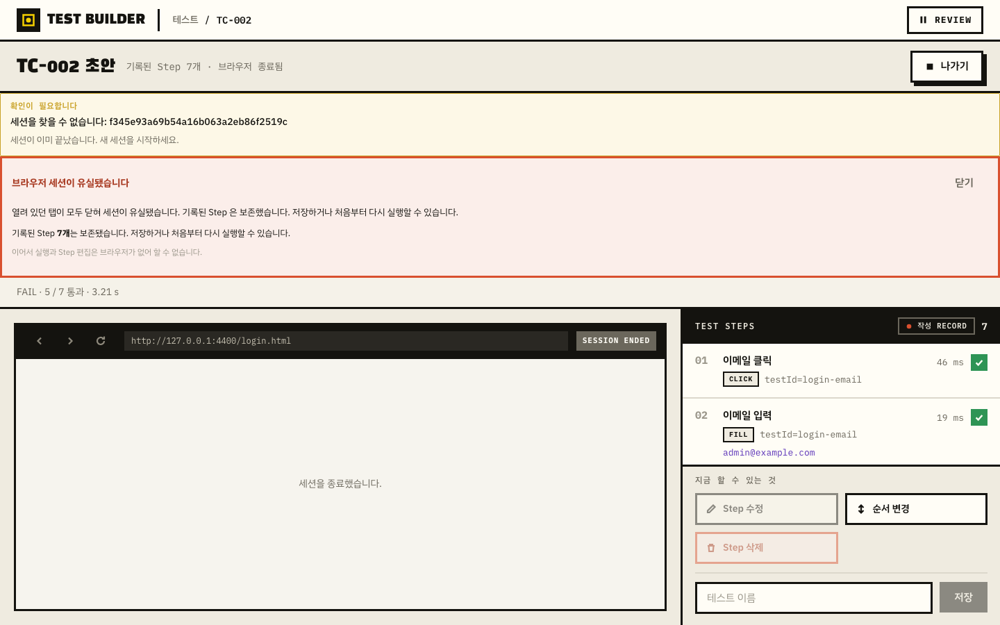
- **왜 그렇게 보이는가**: `backend/src/itb/api/routes/sessions.py:1196` 의 `stop` 은
  의도대로 세션을 `REVIEW` 로 남긴 뒤(DR-010) `state.sessions.close()` 로 브라우저를 놓는다.
  그 close 가 `backend/src/itb/execution/session_loss.py` 의 감지기를 깨우는데,
  `_handle` 의 "정상 종료면 유실이 아니다" 가드가
  `COMPLETED / FAILED / STOPPED / LOST` 만 본다 — **`REVIEW` 가 빠져 있다.**
  그래서 의도적 중지가 매번 `session_lost` 를 발행하고, 그 후처리인 `_loss_handler` 가
  `engine.finalize(False, session_lost=True)` 를 불러 결과를 **FAIL** 로 확정한다
  (`runner.py:532`).
- **하니스 영향**: 이 현상은 CDP 하니스를 쓴 녹화 중지와, 하니스 없이 프론트만 조작한
  실행 중지에서 **모두** 재현됐다. 하니스 탓으로 보기 어렵다. 다만 "탭이 모두 닫혀"라는
  구체적 사유 문구는 감지 경로가 셋이라 어느 것이 걸렸는지 단정하지 않는다.
- **왜 문제인가**: 사용자는 자기가 누른 버튼의 결과를 **사고**로 통보받는다. 중단과 실패가
  구분되지 않아 실행 이력이 오염되고, 배너가 권하는 다음 행동을 화면에서 할 수 없다.
- **개선 방향**:
  1. `session_loss` 의 가드에 `REVIEW` 를 넣는다(그리고 의도적 중지 경로에서는 감지기를
     먼저 떼는 것이 더 안전하다).
  2. 중지 결과를 별도 결말로 남긴다 — `stopped`. 요약은 "중지 · step 06 에서 사용자가
     중지 · 5 / 7 통과". FAIL 집계에 넣지 않는다.
  3. 중지 후 화면은 저장 프롬프트가 아니라 **중지 결과 화면**으로 간다 — "실행을
     중지했습니다" + 「결과 자세히 보기」 「처음부터 실행」 「중지한 Step부터 실행」
     「목록으로」.
  4. 저장된 테스트를 재실행하는 세션에는 "초안" 이라는 말을 쓰지 않는다.
  5. 오류 문구에서 세션 UUID 를 빼고, 종료된 세션을 폴링해 404 를 오류로 띄우지 않는다.
- **손대는 범위**: 중 (`session_loss.py`, `runner.py`/결말 모델, `SessionScreen.tsx`) ·
  **제약 확인**: DR-010("중지는 화면을 떠나지 않는다")은 지킬 수 있다. 화면을 떠나지 않되
  **저장 화면이 아니라 중지 결과 화면**으로 남기면 된다.

### U-04. 「일시정지」는 누른 즉시 "정지했다"고 말하지만 실제로는 계속 실행된다 — 영향도: 상 | 화면: RunnerPaused | 시나리오: S7

- **하려던 것**: 20초 대기 중인 실행을 멈추고 Step 을 고친다.
- **기대**: 정말 멈췄는지, 아니면 멈추는 중인지 화면이 구분해 준다.
- **실제 (실측 타임라인)**:
  | 시각 | 화면 | 실제 |
  |---|---|---|
  | +0.12s | 배지 `PAUSED`, "step 05 이후 정지", 미러에 "**일시정지** 브라우저 세션과 화면 상태를 그대로 유지하고 있습니다", Step 편집 팔레트 전부 노출 | step 06 **실행 중** |
  | +0.12~10s | **모든 버튼 비활성**(속도·계속하기·중지·편집 전부). 아무 설명 없음 | 실행 중 |
  | +10.0s | 노란 배너 등장 — "Step 하나가 10초 안에 끝나지 않아 아직 실행 중입니다. 그 Step 이 끝나면 멈춥니다" | 실행 중 |
  | +19.3s | 배지 여전히 `PAUSED`, "step 06 이후 정지", 여기에 "**FAIL · 5 / 7 통과 · 22.85 s**" 가 붙는다. +10s 배너는 그대로 남아 있다 | 실행 종료(실패) |
- **증거**: 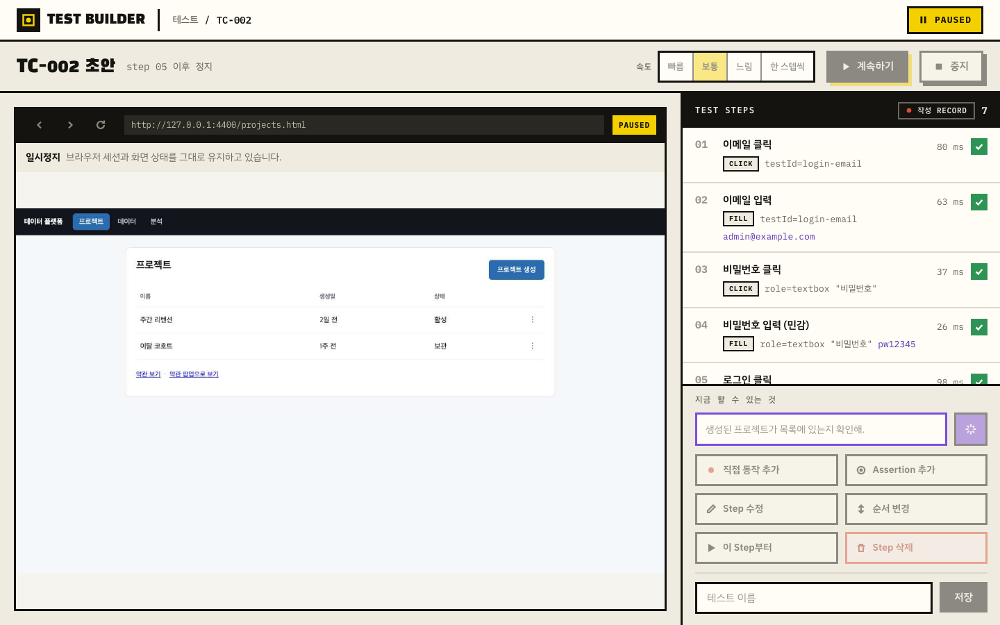
  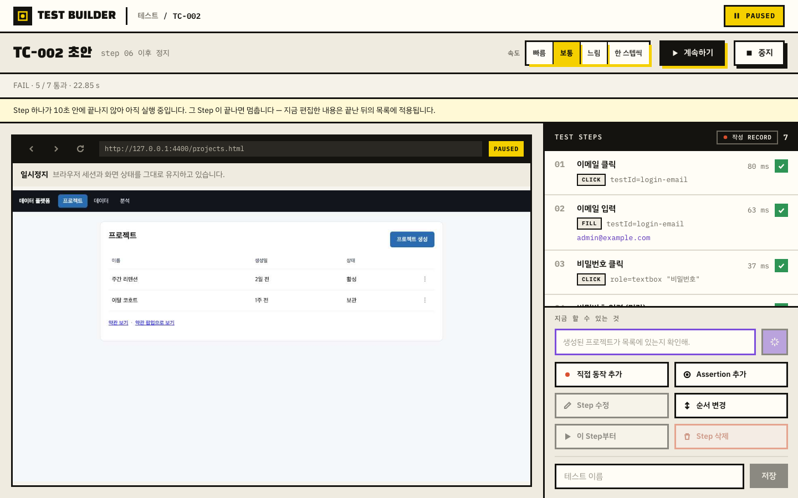
- **왜 문제인가**: 세 가지가 겹친다. (a) 화면이 **아직 아닌 것을 됐다고** 말한다 —
  이 상태에서 Step 을 고치면 무엇에 적용되는지 알 수 없다. (b) 10초간 중지조차 못 하는데
  이유를 말해 주지 않는다. (c) 끝났을 때 `PAUSED` 배지와 `FAIL` 요약이 동시에 떠 지금
  상태가 무엇인지 화면만으로 판단할 수 없다. 게다가 이 화면에는 실패 사유도,
  「결과 자세히 보기」도 없다 — 일시정지를 눌렀다는 이유로 진단 경로를 잃는다.
- **개선 방향**:
  1. 요청이 나가면 **전이 상태**를 만든다 — 배지 `일시정지 중…`, 버튼 라벨 "일시정지 중…",
     그 자리에 "현재 Step 이 끝나면 멈춥니다"를 **즉시**(10초 뒤가 아니라) 표시.
  2. 전이 중에는 편집 팔레트를 열지 않는다. 대신 "정지되면 편집할 수 있습니다"를 보여 준다.
  3. 전이 중에도 「중지」는 살려 둔다 — 기다리다 포기하는 것이 가장 자연스러운 다음 행동이다.
  4. 대기 중인 Step 의 남은 시간을 보여 준다 — "step 06 대기 중 12s / 20s".
  5. 전이 중 실행이 **끝나 버린 경우**를 별도 결말로 처리한다 — 배지를 `실패`로 바꾸고
     "멈추기 전에 실행이 끝났습니다"를 알리며, 실패 사유와 「결과 자세히 보기」를 붙인다.
     낡은 배너는 지운다.
- **손대는 범위**: 중 (`SessionScreen.tsx`, `RunnerPaused.tsx`, pause 응답 계약) ·
  **제약 확인**: 일시정지가 Step 경계에서만 걸리는 것은 설계다(그래서 10초 안내가 있다).
  뒤집자는 것이 아니라 **그 지연을 처음부터 드러내자는 것**이다.

### U-05. 일시정지 상태에서 「계속하기」를 누르면 실패한 Step 을 건너뛰고 「완료」로 표시한다 — 영향도: 상 | 화면: Runner | 시나리오: S7

- **하려던 것**: 일시정지를 풀고 이어서 진행한다.
- **기대**: 멈춘 자리부터 이어 돌거나, 이미 실패했다면 그 사실을 알려 준다.
- **실제**: 0.15초 만에 배지가 **「완료」**, 진행 표시 `step 07 / 07`, step 07 이 127 ms 로
  ✓. **step 06 은 빈 체크박스** — 20초 타임아웃으로 실패했던 Step 이 화면에서 지워졌다.
  바에는 "완료 / 결과 자세히 보기 / 처음부터 다시 실행"만 있다. 실패했다는 말이 없다.
- **증거**: 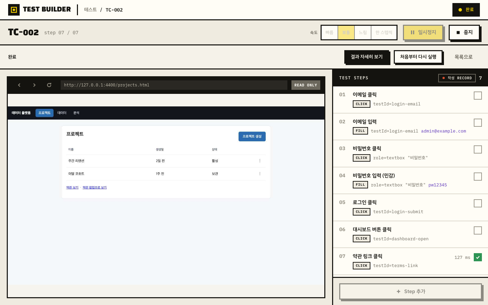
- **저장된 결과와 어긋난다**: `GET /api/tests` 는 여전히 `outcome=fail`, `step_index=5`.
  그래서 같은 목록 화면에 **모순된 두 문장**이 동시에 뜬다 — 배너 "**완료** · Step 7개 ·
  TC-002" 와 행 "**FAIL** · step 05 · 요소를 찾을 수 없습니다…".
- **왜 문제인가**: 실패를 못 본 채 "통과했다"고 믿고 넘어갈 수 있다. 결과 보기 페이지의
  신뢰가 여기서 무너진다.
- **개선 방향**:
  1. 실패한 Step 을 지나 재개하지 않는다. `PAUSED` 로 넘어온 실행에 이미 실패 Step 이 있으면
     「계속하기」를 비활성하고 옆에 이유를 쓴다 — "step 06 이 실패해 이어서 갈 수 없습니다.
     「Step 06 고치기」 또는 「Step 06부터 실행」을 쓰세요."
  2. 그래도 다음 Step 부터 돌리고 싶은 경우는 **다른 버튼**으로 분리한다 —
     「실패한 Step 건너뛰고 계속」. 이 경로의 결말은 `완료` 가 아니라
     `부분 성공 (step 06 건너뜀)`.
  3. 재개 뒤에도 앞선 Step 의 ✓·소요시간을 유지한다 (U-18 과 같은 뿌리).
- **손대는 범위**: 중 (`SessionScreen.tsx` 재개 조건, 결말 판정) · **제약 확인**:
  FR-035/DR-012 의 "멈춰서 고치고 이어간다"는 유지된다. 실패를 **조용히** 건너뛰는 부분만
  막는다.

### U-06. 「처음부터 실행」에 연타 방어가 없어 같은 테스트에 세션(브라우저 창)이 여러 개 만들어진다 — 영향도: 상 | 화면: RunResult·TestList | 시나리오: S5

- **하려던 것**: 결과 화면에서 「처음부터 실행」을 누른다. 반응이 없어 한 번 더 누른다.
- **기대**: 첫 클릭만 받는다.
- **실제**: 52 ms 안에 5회 클릭 → **`POST /api/sessions` 5건 전송**, 그중 **2건이 201** —
  실제 브라우저 창 두 개가 뜨고 같은 테스트를 동시에 두 번 돌았다. 이후 목록에는 구분
  불가능한 배너가 두 줄로 뜬다("실행 중 · Step 7개 · TC-002" ×2, 각각 「이어서 보기」·
  「중지하고 버리기」). `GET /api/sessions` 도 `TC-002` 세션 2개를 돌려줬다.
- **증거**: 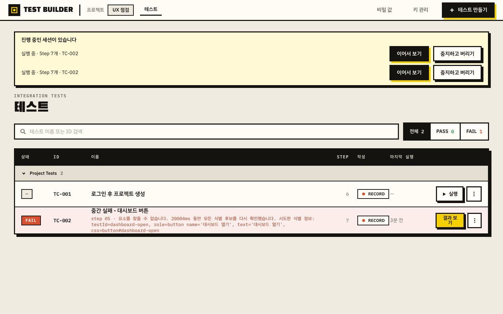
- **왜 그렇게 보이는가**: 프론트에 in-flight 가드가 없다 —
  `frontend/src/App.tsx:65` 의 `startReplay` 는 pending 상태를 두지 않고,
  `RunResult.tsx` 의 두 버튼도 `disabled` 조건이 없다.
  백엔드의 중복 방지도 검사-후-생성이라 경쟁에 진다 —
  `backend/src/itb/api/routes/sessions.py:335` 에서 `active_session_for_test` 를 본 뒤
  `await state.sessions.create(...)` 를 하는데, 그 사이 락이 없어 다섯 요청이 모두 검사를
  통과한다. FR-043("테스트당 동시 실행 1건")이 실제로는 지켜지지 않는다.
- **왜 문제인가**: 대상 앱에 두 배의 부하가 가고, 결과가 어느 실행의 것인지 알 수 없고,
  브라우저 창을 손으로 정리해야 한다. 결과 페이지 신뢰 문제로 곧장 이어진다.
- **개선 방향**:
  1. 실행 트리거 버튼 전부에 in-flight 가드 — 첫 클릭에 `disabled` + 라벨을
     "실행을 준비하는 중…"으로. (U-11 의 무피드백도 같이 해결된다)
  2. 백엔드에 테스트별 생성 락(또는 `_by_test` 선점 예약)을 둔다. 화면이 새지 않더라도
     경계에서 막혀야 한다.
  3. 목록 배너가 세션을 여럿 보여줄 때는 구분 정보(시작 시각·세션 짧은 ID)를 붙인다.
- **손대는 범위**: 중 (`App.tsx`, `RunResult.tsx`, `TestList.tsx`, `sessions.py`,
  `session.py`) · **제약 확인**: FR-043 을 **지키기 위한** 수정이다.

### U-07. 목록의 실패 Step 번호가 실제보다 1 작다 — 영향도: 상 | 화면: TestList | 시나리오: S3

- **하려던 것**: 목록에서 어느 Step 이 깨졌는지 본다.
- **기대**: 결과 화면과 같은 번호.
- **실제**: 목록은 "**step 05** · 요소를 찾을 수 없습니다 … testId=dashboard-open".
  결과 화면과 러너는 "**STEP 06 실패**", Step 목록의 ✕ 도 06 에 있다. `dashboard-open` 은
  6번째 Step 이다. 목록만 틀렸다.
- **증거**:  (행 요약) 대
  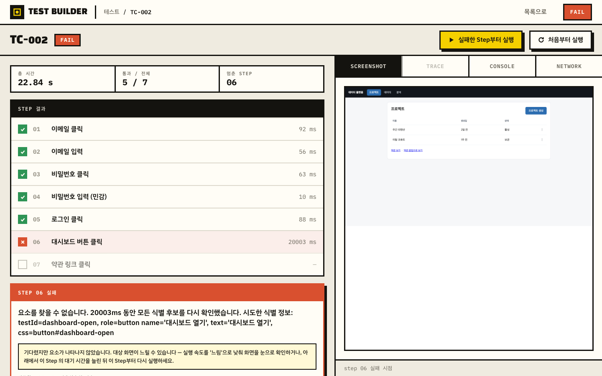 (결과 화면)
- **왜 그렇게 보이는가**: `frontend/src/pages/TestList.tsx:522` 가
  `String(row.failure_summary.step_index).padStart(2, "0")` 로 **0-기반 인덱스를 그대로**
  쓴다. 같은 저장소의 다른 렌더링은 모두 `index + 1` 이다
  (`RunResult.tsx:255,308,365,478,562`, `StepInspector.tsx:138`, `TestDefinition.tsx:186`,
  `SessionScreen.tsx:688`). API 응답도 `failure_summary.step_index = 5` 로 0-기반이 맞다.
- **왜 문제인가**: 사용자가 신고한 "실패한 Step부터 실행이 어디서 시작되는지 예측 가능한가"의
  절반이 이것이다. 목록에서 05 를 보고 결과에서 06 을 보면 어느 쪽이 시작점인지 알 수 없다.
  1 Step 어긋난 판단은 곧 잘못된 Step 을 고치는 결과가 된다.
- **개선 방향**: `+ 1` 을 붙인다. 덧붙여 0-기반/1-기반 변환을 한 군데(`stepLabel(index)`)로
  모아 같은 실수가 반복되지 않게 한다.
- **손대는 범위**: 소 (`TestList.tsx` 1줄 + 공용 헬퍼) · **제약 확인**: 없음.

### U-08. 실행이 끝난 뒤에도 「중지」가 활성으로 남고, 누르면 확인 없이 세션을 폐기하며 목록으로 튄다 — 영향도: 상 | 화면: Runner | 시나리오: S6·S8

- **하려던 것**: 실행이 끝난 화면을 정리한다.
- **기대**: 끝난 실행에 「중지」는 비활성이거나, 눌러도 되돌릴 수 있다.
- **실제**: 완료(PASS)·실패 모두 **속도 4버튼과 「일시정지」는 회색으로 비활성이 되는데
  「중지」만 검은 테두리·그림자 그대로 활성**이다. 화면에서 가장 눈에 띄는 컨트롤이다.
  눌러 보면 0.11초에 `POST /api/sessions/{id}/discard` 204 가 나가고 **확인 대화상자 없이**
  목록으로 이동하며, 아무 메시지도 남지 않는다.
- **증거**: 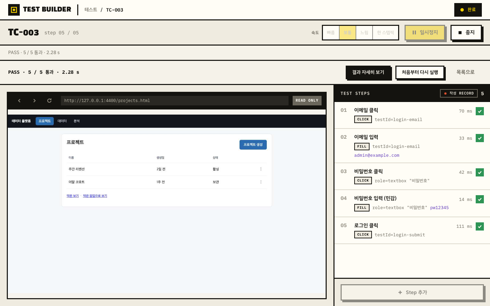
  (완료 상태: 속도·일시정지 비활성 / 중지만 활성)
- **왜 그렇게 보이는가**: `frontend/src/pages/SessionScreen.tsx:702` 가
  `canPause={!isDone}` 로 일시정지만 잠그고, 중지는 `onStop={isDone ? leave : stop}` 로
  **의미를 바꿔** 그대로 열어 둔다. `leave`(`:425`)는 `has_unsaved_changes` 가 아닐 때
  확인 없이 `discard` 한다. 저장된 테스트의 재실행에는 미저장 변경이 없으므로 항상
  무확인 경로를 탄다.
- **연타 결과(신고 항목 2)**: 첫 클릭이 화면을 목록으로 바꿔 버려 두 번째 클릭은 대상이
  없어진다. 즉 요청은 1건만 나가고 서버 오류도 없다 — 다만 **버튼이 계속 눌리는 것처럼
  보이는 이유는 라벨·활성 상태가 실행 중과 완전히 같기 때문**이다. 전이 상태
  ("중지 중…")도 없다. 실행 중 중지 연타는 U-04 와 같은 방식으로 in-flight 동안 전체
  비활성이 걸려 요청 1건만 나갔다.
- **왜 문제인가**: 같은 버튼이 상황에 따라 "실행 중단" 과 "세션 폐기 + 화면 이탈" 두 가지로
  동작하는데 라벨이 같다. 특히 **PASS 한 실행의 결과는 목록에서 다시 열 수 없어**(U-13)
  이 버튼 한 번으로 결과 화면에 도달할 길이 사라진다.
- **개선 방향**:
  1. 끝난 실행에서는 「중지」를 **라벨부터 바꾼다** — 「닫기」 또는 「세션 정리」.
     위치도 파괴적 동작 자리(오른쪽 보조)로 내리고 강조를 뺀다.
  2. 실행 중 「중지」에는 전이 상태를 준다 — 누르면 "중지 중…"으로 바뀌고 비활성.
  3. 세션 폐기가 결과 접근을 끊을 수 있는 경우에는 한 번 묻는다 — "이 실행 화면을 닫습니다.
     결과는 목록의 「결과 보기」에서 다시 볼 수 있습니다." (U-13 을 함께 고치면 이 문장이
     사실이 된다)
- **손대는 범위**: 소~중 (`SessionScreen.tsx`, `Runner` 헤더) · **제약 확인**: 없음.

---

### U-09. 저장이 성공했는지 화면이 말해 주지 않는다 — 영향도: 중 | 화면: RunnerPaused(REVIEW) | 시나리오: 저장

- **하려던 것**: 녹화한 것을 이름을 붙여 저장한다.
- **기대**: "저장했습니다" 또는 목록으로 이동.
- **실제**: `POST /api/sessions/{id}/save` 는 30 ms 에 200 으로 성공한다. 그런데 화면은:
  - **성공 알림이 없다.** 토스트·배너·체크 표시 어느 것도 없다.
  - 제목이 **여전히 「TC-001 초안」** — 저장했는데 "초안"이라고 쓰여 있다.
  - 이름 입력칸에 입력값이 그대로 남고 「저장」 버튼도 그대로 활성이다.
  - 화면 이동도 없다.
  - **유일한 변화는 빵부스러기가 "새 테스트" → "TC-001" 로 바뀐 것** 하나다. 알아채기 어렵다.
  - 이전 화면에 떠 있던 경고 배너("세션을 찾을 수 없습니다: …")가 그대로라 새로 뜬 것이
    없다는 인상이 더 강해진다.
- **증거**: 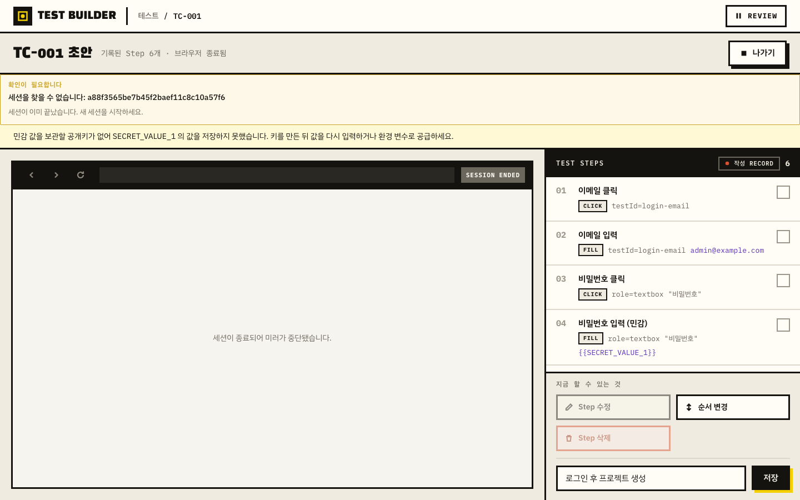
- **왜 그렇게 보이는가**: `frontend/src/pages/SessionScreen.tsx:323` 의 `save()` 는
  `sessions.save(...)` 후 `resync()` 만 한다 — 알림도, 이름 초기화도, 화면 전환도 없다.
  (같은 파일 `:454` 의 `saveAndLeave` 는 「나가기」 확인 경로에서만 쓰인다.)
- **연타·중복 저장(신고 항목 1)**: 이름을 채운 상태로 3회 연타해도 **`POST …/save` 는
  1건만** 나갔다. `RunnerPaused.tsx:457` 의 `disabled={busy || …}` 가 in-flight 를 막는다.
  중복 테스트가 생기지 않는 것은 확인했다(목록은 TC-001 1건). 다만 **성공 표시가 없으니
  사용자는 연타할 이유가 계속 생긴다.**
- **저장 여부를 확인하려면**: 「나가기」로 목록에 가서 배너가 "검토 중 · Step 6개 ·
  **TC-001**"(저장 전에는 "저장되지 않음")로 바뀌었는지, 또는 목록에 행이 생겼는지 봐야
  한다. 즉 **화면을 옮겨야 알 수 있다.**
- **미저장 이탈 경고**: 있다. 저장 안 한 상태에서 「나가기」를 누르면 확인이 뜨고
  (`confirmingLeave`), 브라우저 새로고침·닫기도 `beforeunload` 로 한 번 막는다
  (`SessionScreen.tsx:349`). 이 부분은 잘 돼 있다.
- **개선 방향**:
  1. 저장 성공 시 **인라인 확인**을 붙인다 — 저장 영역에 "저장했습니다 · TC-001 ·
    `tests/TC-001-….yaml`" + 「목록에서 보기」.
  2. 제목의 "초안"을 뗀다. 저장 후에는 「TC-001 · 저장됨」.
  3. 저장 후 버튼 라벨을 「변경 저장」으로 바꾸고, 이름을 안 바꾸면 비활성으로 둔다.
  4. 남아 있던 이전 오류 배너는 성공 시 걷어낸다.
- **손대는 범위**: 소 (`SessionScreen.tsx`, `RunnerPaused.tsx`) · **제약 확인**: 없음.
- **미검증**: 저장 **실패**(디스크 오류·권한)일 때의 표시는 재현하지 못했다.
  `save()` 는 `setError` 로 상단 배너를 띄우게 되어 있지만 실제 화면은 확인 못 했다.

### U-10. 저장을 마친 세션을 정리하는 유일한 방법이 "Step 6개가 사라집니다. 정말 버릴까요?" 다 — 영향도: 중 | 화면: TestList | 시나리오: 저장

- **실제**: 저장에 성공해 TC-001 이 목록에 있는데도 배너는 남아 있고, 정리 버튼은
  「중지하고 버리기」다. 누르면 "**Step 6개가 사라집니다. 정말 버릴까요?**" 가 뜬다.
  저장된 테스트는 사라지지 않는데 사라진다고 말한다.
- **증거**: 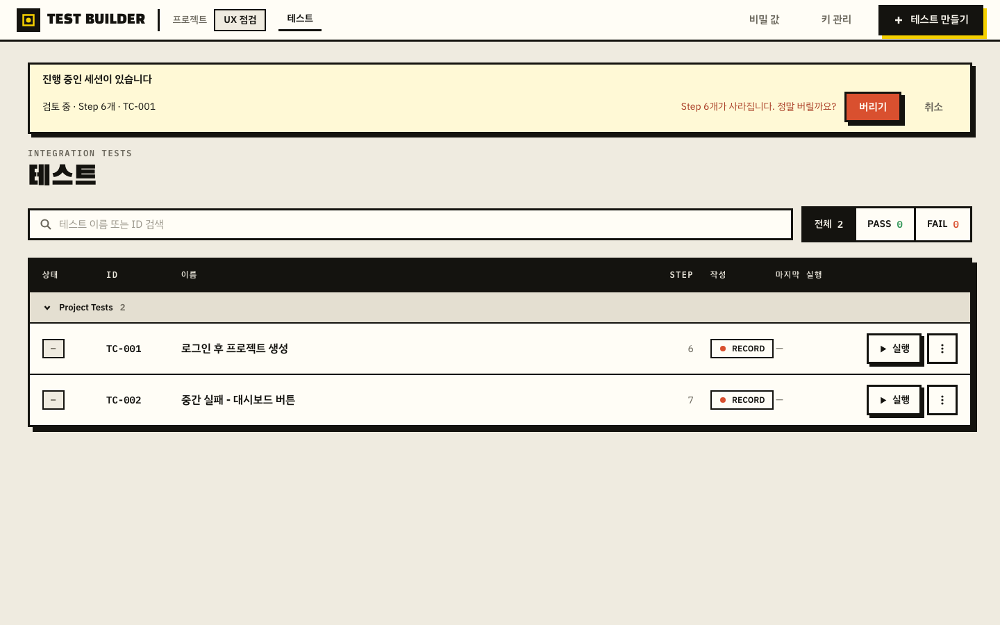
- **왜 문제인가**: 저장 확인 표시가 없는 상태(U-09)에서 이 문장을 만나면 "저장이 안 된
  건가?" 하고 손을 멈춘다. 실제로 그 자리에서 진행을 포기하기 쉽다.
- **개선 방향**: 저장 이력이 있는 세션에는 문구를 바꾼다 — 「닫기」 + "TC-001 로 저장돼
  있습니다. 이 작업 창만 닫습니다." 저장 안 된 세션에만 현재 경고를 쓴다.
- **손대는 범위**: 소 (`TestList.tsx` 배너) · **제약 확인**: 없음.

### U-11. 실행 버튼을 눌러도 약 1초간 화면이 아무 말도 하지 않는다 — 영향도: 중 | 화면: TestList·RunResult | 시나리오: S3·S5

- **실제**: 목록에서 「실행」을 누르고 0.2초 뒤 화면은 **완전히 그대로**다 — 버튼 상태도,
  진행 표시도, 문구도 없다. 러너로 넘어간 시점은 +0.8s(다른 회차 +1.2s)였고
  `POST /api/sessions` 응답이 그때 왔다. 결과 화면의 「처음부터 실행」도 같다(+0.38s 까지
  화면 무변화, 버튼 전부 활성).
- **증거**: 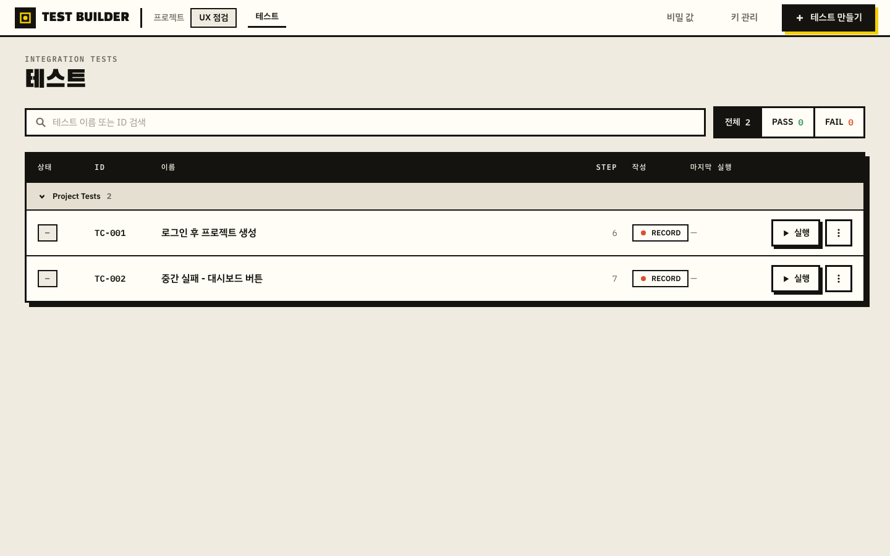
- **왜 문제인가**: 브라우저를 띄우는 동안이라 1초를 넘기는 것이 정상인데, 화면이 침묵하니
  다시 누른다 → U-06 의 세션 중복으로 직결된다.
- **개선 방향**: 클릭 즉시 버튼 비활성 + "브라우저를 띄우는 중…". 화면 전환은 세션 생성
  응답을 기다리지 말고 곧바로 러너 골격을 열고 그 안에서 준비 상태를 보여 주는 편이 낫다.
- **손대는 범위**: 소~중 (`App.tsx`, `TestList.tsx`, `RunResult.tsx`) · **제약 확인**:
  브라우저가 headed 로 뜨는 것은 설계다. 그 대기를 화면이 말하게 하는 것뿐이다.

### U-12. 한 번 실패한 테스트는 목록에서 다시 실행할 수 없다 — 영향도: 중 | 화면: TestList | 시나리오: S5

- **실제**: 결과가 FAIL 인 행은 「실행」 버튼이 **「결과 보기」로 바뀐다.** 케밥 메뉴에도
  「정의 보기 / 이름 / 삭제」뿐 실행이 없다. 재실행하려면 결과 보기로 들어가야 하고,
  거기서는 U-01 로 막힌다.
- **왜 그렇게 보이는가**: `frontend/src/pages/TestList.tsx:568` — `failed ? 결과 보기 : 실행`.
  한 자리에 둘 중 하나만 둔다.
- **개선 방향**: 행에 「실행」을 항상 두고, 결과가 있으면 「결과 보기」를 보조로 함께 둔다
  (또는 상태 칩 `FAIL` 자체를 결과 링크로 만든다).
- **손대는 범위**: 소 (`TestList.tsx`) · **제약 확인**: 없음.

### U-13. 성공한 실행의 결과는 어디서도 열 수 없다 — 영향도: 중 | 화면: TestList | 시나리오: S8

- **실제**: TC-003 이 PASS 로 끝나 상태 칩은 `PASS`, "마지막 실행 방금"까지 뜨는데
  행의 버튼은 「실행」뿐이고 케밥에도 결과가 없다. 러너 화면을 닫으면(U-08) 그 실행의
  소요 시간·Step별 시간·스크린샷에 도달할 길이 없다.
- **왜 문제인가**: "왜 갑자기 느려졌지" 같은 정상 경로의 확인이 불가능하다. 결과 보기
  페이지가 **실패 전용 화면**이 되어 있다.
- **개선 방향**: 결과가 있는 모든 행에 「결과 보기」를 둔다. 결과 화면의 PASS 표시는 이미
  준비돼 있다(`RunResult.tsx:120` 부근의 `failed` 분기).
- **손대는 범위**: 소 (`TestList.tsx`) · **제약 확인**: 없음.

### U-14. 진행 표시가 실패·미실행 Step 을 포함해 "07 / 07" 로 센다 — 영향도: 중 | 화면: Runner | 시나리오: S3

- **실제**: step 06 에서 실패해 07 이 실행되지 않았는데 헤더는 `step 07 / 07`.
  전부 처리한 것처럼 읽힌다. 실패 Step 번호는 아래 요약 바에서 따로 찾아야 한다.
- **왜 그렇게 보이는가**: `frontend/src/pages/SessionScreen.tsx:688` —
  `Math.min(currentIndex + 1, view.steps.length)`. 실패로 인덱스가 한 칸 넘어간 뒤 그 값을
  그대로 쓴다.
- **개선 방향**: 끝난 실행에서는 진행 표시를 결말 표시로 바꾼다 — "step 06 에서 실패 ·
  7 Step 중 5 통과".
- **손대는 범위**: 소 · **제약 확인**: 없음.

### U-15. 결과 화면에 URL 이 없어 새로고침하면 목록으로 돌아가고, 뒤로가기는 앱을 벗어난다 — 영향도: 중 | 화면: RunResult | 시나리오: S9

- **실제**: 결과 화면에서도 주소는 `http://127.0.0.1:4410/` 다. 새로고침하면 목록으로
  되돌아간다(결과 자체는 남아 있어 「결과 보기」로 다시 열 수 있다). 브라우저 뒤로가기를
  누르면 `about:blank` 로 나가 **앱을 완전히 이탈**한다.
- **증거**: 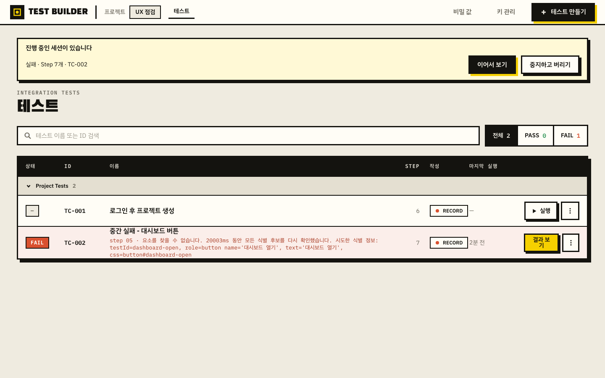
- **왜 문제인가**: 결과를 동료에게 "이 화면 봐 주세요"로 공유할 수 없고, 브라우저의 기본
  조작(뒤로가기)이 앱을 날린다. 로컬 도구라도 화면은 브라우저 안에 있다.
- **개선 방향**: 최소한 `?screen=result&test=TC-002` 수준의 라우팅과 history push 를 둔다.
  최소 조치만 하려면 뒤로가기를 앱 내부 이동(목록)으로 잡아 이탈만 막는다.
- **손대는 범위**: 중 (`App.tsx` 화면 상태 → 라우터) · **제약 확인**: 없음.

### U-16. 실행 중 새로고침하면 러너를 잃고 목록으로 떨어지며, 그 행은 여전히 이전 결과를 보여 준다 — 영향도: 중 | 화면: TestList | 시나리오: S9

- **실제**: 실행 중 새로고침 → 목록. 상단 배너가 "실행 중 · Step 7개 · TC-002 ·
  「이어서 보기」"를 주므로 복귀는 가능하다(이 회수 장치는 좋다). 그런데 **행의 상태 칩은
  이전 실행의 `FAIL`** 이고 버튼도 「결과 보기」(이전 결과)다. 지금 돌고 있다는 표시가
  행에는 없다.
- **증거**: 
- **개선 방향**: 실행 중인 테스트의 행에 `RUNNING` 칩과 「실행 화면 보기」를 띄운다.
  기본은 러너 화면으로 복귀시키는 것이 더 낫다(U-15 의 라우팅과 함께).
- **손대는 범위**: 소~중 (`TestList.tsx`) · **제약 확인**: 없음.

### U-17. 목록의 세션 배너가 갱신되지 않아 끝난 실행이 계속 "실행 중"으로 남는다 — 영향도: 중 | 화면: TestList | 시나리오: S9

- **실제**: 실행 중에 목록으로 온 뒤 25초를 더 기다렸다(실행은 그 사이 실패로 끝났다).
  배너는 계속 "**실행 중** · Step 7개 · TC-002". 새로고침해야 "실패 · …"로 바뀐다.
- **개선 방향**: 배너에 세션 이벤트를 붙이거나 짧은 주기로 다시 읽는다. 최소한 「새로
  고침」 버튼을 배너 안에 둔다.
- **손대는 범위**: 소~중 · **제약 확인**: 없음.

### U-18. 끝난 실행을 다시 열면 Step별 ✓·소요시간이 사라진다 — 영향도: 중 | 화면: Runner | 시나리오: S9

- **실제**: 실행 직후 러너에서는 Step 마다 ✓ 와 `92 ms` 가 보인다. 목록으로 나갔다
  「이어서 보기」로 같은 세션을 다시 열면 **모든 Step 이 빈 체크박스**가 되고 시간도 없다.
  결말 요약("완료", "FAIL · …")만 남는다.
- **증거**: 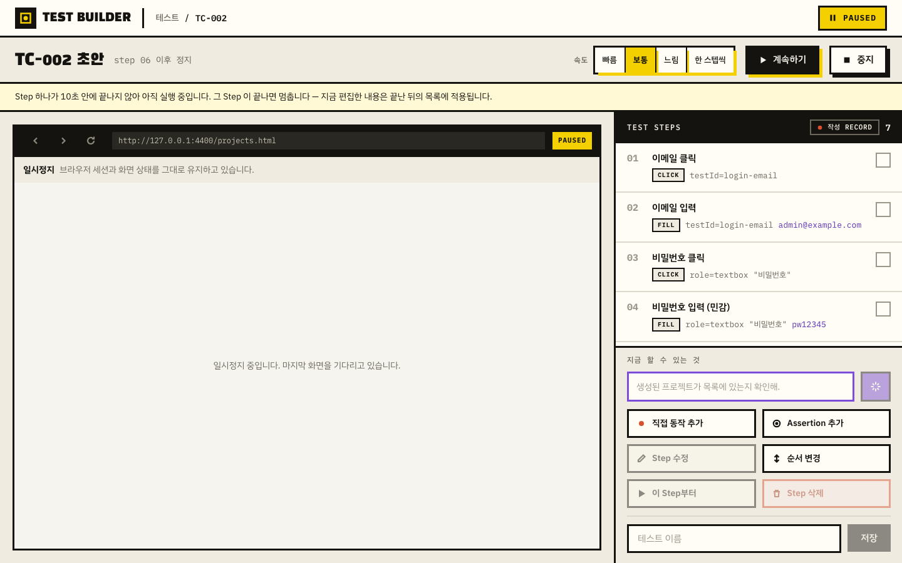
- **왜 그렇게 보이는가**: Step별 결과가 WebSocket 이벤트로만 채워지는 컴포넌트 로컬 상태
  (`SessionScreen.tsx` 의 `progress`/`durations`)에 있다. 화면을 다시 그리면 비어 버린다.
  세션 조회 응답에는 Step별 결과가 없다.
- **왜 문제인가**: 어디까지 갔는지 다시 볼 수 없다. U-05 의 "실패가 사라져 보이는" 현상도
  같은 뿌리다.
- **개선 방향**: 세션 조회 응답에 Step별 결과(outcome·duration)를 실어 화면이 이벤트 없이도
  복원되게 한다.
- **손대는 범위**: 중 (세션 뷰 계약 + `SessionScreen.tsx`) · **제약 확인**: 스키마 변경 시
  생성물 재생성 의무(헌법 Cross-language schema duty).

### U-19. 결말 요약이 같은 화면에 두 번 표시된다 — 영향도: 중 | 화면: Runner | 시나리오: S3·S8

- **실제**: 실행이 끝나면 헤더 아래 얇은 회색 띠에 "PASS · 5 / 5 통과 · 2.28 s" 가 있고,
  바로 아래 결말 바에 같은 문장이 큰 글씨로 또 있다. 실패도 같다.
- **증거**: 
- **왜 문제인가**: 같은 값이 두 번 나오면 사용자는 둘이 다른 것인지 확인하느라 멈춘다.
  세로 공간도 배너 쌓임과 겹쳐 Step 목록을 밀어낸다(중지 직후에는 배너 3개 + 요약 2개로
  Step 이 2개만 보였다).
- **개선 방향**: 얇은 띠를 없애고 결말 바 하나만 남긴다.
- **손대는 범위**: 소 · **제약 확인**: 확정 디자인(`docs/design/`)에 얇은 띠가 정의돼
  있다면 **의도 확인 필요**.

### U-20. 같은 결말을 화면마다 다른 말로 부른다 — 영향도: 중 | 화면: 전역 | 시나리오: S3·S8

- **실제**: 한 화면 안에서도 배지는 「완료」/「실패」, 요약 바는 `PASS`/`FAIL`, 목록 칩은
  `PASS`/`FAIL`, 목록 배너는 「완료」/「실패」/「실행 중」/「검토 중」이다. Step 도
  "Step" 과 "step" 과 "단계"가 섞인다(예: "step 05 이후 정지" / "STEP 06 실패" /
  "Step 06 고치기").
- **개선 방향**: 결말 어휘를 하나로 정한다(사용자 표시는 한국어 「통과/실패/중지/부분 성공」,
  기술 라벨 PASS/FAIL 은 칩에서만). Step 표기도 한 형태로 고정한다.
- **손대는 범위**: 소~중(문구 사전) · **제약 확인**: 확정 디자인의 대문자 라벨 사용은
  존중하되 **한 화면에 두 어휘가 동시에 나오는 것**만 없앤다.

### U-21. 건너뛴 Step 과 도달하지 못한 Step 이 똑같이 보인다 — 영향도: 중 | 화면: RunResult | 시나리오: S4

- **실제**: 부분 실행 결과에서 건너뛴 01~05 와, 실패로 도달하지 못한 07 이 모두
  "빈 체크박스 + —" 다.
- **증거**: 
- **개선 방향**: `건너뜀`(회색 칩)과 `미실행`(점선 표시)을 구분한다. 색만으로 구분하지 않고
  텍스트 라벨을 함께 둔다(접근성).
- **손대는 범위**: 소 (`RunResult.tsx:562` 부근) · **제약 확인**: 없음.

---

### U-22. TRACE 탭이 왜 비활성인지 말해 주지 않고, 빈 탭은 다음 행동이 없다 — 영향도: 하 | 화면: RunResult | 시나리오: S3

- **실제**: 증거 탭 4개 중 `TRACE` 만 `disabled`(opacity 0.45, cursor not-allowed)이고
  `title` 도 없어 이유를 알 수 없다. `CONSOLE`·`NETWORK` 는 눌리는데 큰 빈 상자에
  "(기록 없음)" 한 줄만 있다.
- **증거**: 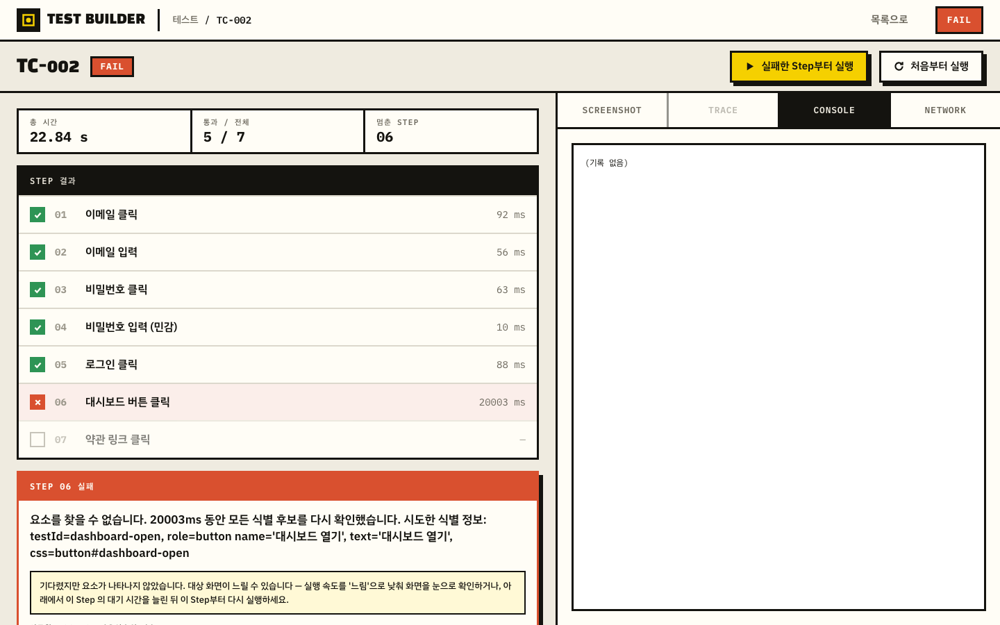
- **개선 방향**: 비활성 탭에 이유를 붙인다 — "이 실행에는 trace 가 남지 않았습니다
  (실패한 실행에서만 수집)". 빈 탭에는 "콘솔 오류가 없었습니다"처럼 **없다는 사실**을
  긍정문으로 쓰고, 수집 조건을 한 줄 덧붙인다.
- **손대는 범위**: 소 · **제약 확인**: 없음.

### U-23. 녹화 중에도 실행용 「속도」 컨트롤이 같은 자리에 그대로 있다 — 영향도: 하 | 화면: SessionScreen(녹화) | 시나리오: S2

- **실제**: 직접 녹화 중 헤더에 「속도: 빠름/보통/느림/한 스텝씩」이 실행 중과 동일하게
  활성으로 있다. 사람이 직접 조작하는 국면에서 재생 속도가 무엇을 의미하는지 화면이
  설명하지 않는다.
- **개선 방향**: 녹화 국면에서는 감추거나, "다음 실행에 쓸 속도" 라고 밝힌다.
- **제약 확인**: **의도 확인 필요** — 004(run pacing) 명세에서 녹화 중 노출이 의도인지
  확인이 필요하다.

---

## 잘 된 점

개선 과정에서 잃지 않아야 하는 것들.

- **결과 보기 페이지의 정보 구성.** 상단 3칸 요약(총 시간 / 통과·전체 / 멈춘 STEP),
  Step별 결과 목록, 실패 사유 + **다음 행동 안내**, 「시도한 LOCATOR (우선순위 순)」에
  후보별 ✕ 표시, 증거 4탭. 실패 진단에 필요한 것이 한 화면에 모여 있다.
  
- **실패 시점 스크린샷이 기본 탭으로 먼저 열린다.** 이번 워크스루에서 "로그인 화면에서
  실패했다"는 사실을 알아낸 것도 이 스크린샷이었다(U-02).
- **오류 문구가 원인·근거·다음 행동을 갖춘 경우가 많다.** "요소를 찾을 수 없습니다.
  20003ms 동안 모든 식별 후보를 다시 확인했습니다. 시도한 식별 정보: …" 는 무엇을 얼마나
  기다렸는지까지 말한다.
- **세션 회수 장치.** 화면을 잃어도 목록 상단 배너가 "진행 중인 세션이 있습니다 · 상태 ·
  Step 수 · 저장 여부"와 「이어서 보기」를 준다. 녹화 중 창을 닫아도 Step 을 잃지 않았다.
- **미저장 이탈 보호.** 「나가기」 확인과 `beforeunload` 가 둘 다 걸려 있다.
- **일시정지·중지의 in-flight 중복 방지.** 요청이 나가 있는 동안 컨트롤이 비활성이라
  연타로 요청이 늘어나지 않았다(라벨이 안 바뀌는 것은 U-04·U-08 로 별도).
- **저장 연타로 테스트가 중복 생성되지 않는다.** 3연타에도 `POST …/save` 1건.
- **빈 상태 문구.** 첫 화면과 테스트 목록의 빈 상태가 저장 위치까지 설명한다.
- **미러의 읽기 전용 고지.** "실제 브라우저 창에서 조작 중 / 이 영역은 관찰용이며 조작
  대상이 아닙니다"가 미러 위에 붙어 있다(FR-047a 를 화면이 제대로 말한다).

## 미검증 · 확인 필요

- **AI 작성(US4)·사람 인수(US5)** — 언어모델 자격 증명이 없어 「AI로 만들기」 카드가
  "언어모델 자격 증명을 찾을 수 없습니다"로 막혔다. 이 경로의 실행 제어(AI 실행 중
  중지·일시정지)는 **전혀 검증하지 못했다.**
- **저장 실패 표시** — 디스크·권한 실패를 재현하지 못했다. 코드상 상단 오류 배너로
  가게 되어 있으나 화면은 확인 못 했다.
- **U-03 의 "탭이 모두 닫혀" 사유 문구** — 유실 감지 경로가 셋(브라우저 disconnected /
  컨텍스트 close / 모든 탭 닫힘)이라 어느 신호가 걸렸는지 단정하지 않았다. `REVIEW` 가
  가드에서 빠져 있다는 사실과 "중지가 유실 오류로 보인다"는 결과는 두 경로(녹화 중지·
  실행 중지)에서 재현했다.
- **U-19(요약 중복)·U-23(녹화 중 속도 컨트롤)** — 확정 디자인·004 명세의 의도일 가능성이
  있어 **의도 확인 필요**로 남긴다.
- **키보드 단독 진행·포커스 가시성** — 이번 범위(실행 제어)에 집중해 접근성 항목은
  체계적으로 걷지 않았다. 다만 결과 화면의 비활성 `TRACE` 탭이 `title` 없이 색·투명도만으로
  상태를 전하는 점은 U-22 에 포함했다.
- **참고(화면 밖)**: `GET /api/health` 가 실제 바인딩 포트와 무관하게
  `"bind":"127.0.0.1:4320"` 을 돌려준다(4420 으로 띄운 상태). 화면에 노출되지 않아 발견
  항목으로 세지 않았으나, 포트를 바꿔 띄웠을 때 진단을 오도할 수 있다.
- **환경 주의** — 워크스루 도중(12:56~13:01) 저장소의 다른 파일들이 병행 작업으로
  수정됐다(`backend/src/itb/secrets/*`, `backend/src/itb/api/app.py`,
  `frontend/src/pages/KeyManagement.tsx` 등 비밀값·키 관리 계열). 이 워크스루는 제품 코드를
  수정하지 않았고, 관찰한 화면은 모두 실행 제어·결과 보기 계열이라 겹치지 않는다. 다만
  프론트가 Vite 개발 서버(HMR)였으므로 **키 관리 화면 관련 관찰은 이 리포트에 포함하지
  않았다.**
